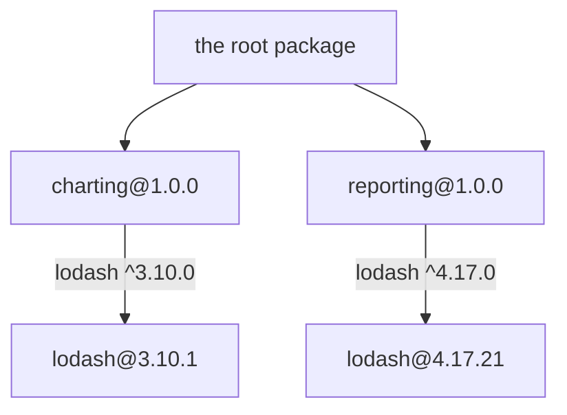

# How Dependencies Get Resolved

Your `package.json` describes a *graph*: packages depending on packages, each
with a range rather than a version. What ends up on disk is a *tree*, and a
directory can hold only one version of a name. Almost every confusing dependency
problem - a duplicated library, a phantom import that works until it doesn't, an
`ERESOLVE` wall of text - comes from the gap between those two shapes.

Two separate resolutions are involved, and keeping them apart makes the rest
straightforward:

| | Who | When | Decides |
| --- | --- | --- | --- |
| **Install-time resolution** | npm / pnpm / yarn | `npm install` | which versions exist, and in which directories |
| **Runtime resolution** | Node itself | every `import` / `require` | which file on disk a specifier points at |

## Runtime: how Node finds a package

For a **bare specifier** like `import "lodash"`, Node does not search a path
variable or consult `package.json`. It walks up the directory tree from the
importing file, looking in each `node_modules` it passes:

```
/srv/app/src/routes/users.mjs   imports "lodash"
  ├─ /srv/app/src/routes/node_modules/lodash   ← first candidate
  ├─ /srv/app/src/node_modules/lodash
  ├─ /srv/app/node_modules/lodash              ← usually found here
  └─ /srv/node_modules/lodash  →  /node_modules/lodash
```

The first hit wins, and nothing further up is consulted. That single rule is
what makes nesting work: a package sitting in
`node_modules/reporting/node_modules/lodash` shadows the root copy *for code
inside `reporting`*, and is invisible to everyone else.

Having found the directory, Node reads its `package.json` to pick the file:

1. **`exports`**, if present, is authoritative. It maps subpaths to files and
   blocks everything it does not list.
2. Otherwise `main`, defaulting to `index.js`.
3. Relative specifiers (`./util.mjs`) skip all of this - in ESM they must
   include the file extension.

Deep-importing past an `exports` map fails loudly, which is the point:

```
ERR_PACKAGE_PATH_NOT_EXPORTED: Package subpath './dist/index.js' is not defined
by "exports" in .../node_modules/@acme/duration/package.json
```

::: tip Ask the runtime instead of guessing
`import.meta.resolve("pkg")` (ESM) and `require.resolve("pkg")` (CommonJS)
print the exact file a specifier lands on. `NODE_DEBUG=module node app.js` goes
further and prints the walk itself:

```
MODULE 431204: looking for "react" in ["/srv/app/node_modules",
  "/srv/node_modules","/node_modules", …]
```

That is the install-time question's mirror image; `npm explain <pkg>` answers
the other half.
:::

## Install time: turning a graph into a tree

npm processes dependencies breadth-first and applies three rules to each one:

1. **Reuse** a copy already visible from where the dependent will sit, if it
   satisfies the range. (This is deduplication.)
2. Otherwise **hoist** the highest satisfying version to the root
   `node_modules`, if the root has no copy of that name yet.
3. Otherwise **nest** it inside the dependent's own `node_modules`.

That is the whole algorithm, and it is short enough to write down:

<<< ../../examples/javascript/packages/resolution-tree.mjs#placement{js}

### When the ranges overlap: one copy

```
2. overlapping ranges - deduplicated into a single copy

  the root package depends on:
    charting: "^1.0.0"
    reporting: "^1.0.0"

  what the installer decided:
    hoist  charting@1.0.0 to the root (the root package wants ^1.0.0)
    hoist  reporting@1.0.0 to the root (the root package wants ^1.0.0)
    hoist  lodash@4.17.21 to the root (charting@1.0.0 wants ^4.16.0)
    reuse  lodash@4.17.21 for reporting@1.0.0 (wants ^4.17.0)

  node_modules/
    ├─ charting@1.0.0
    ├─ lodash@4.17.21
    └─ reporting@1.0.0
```

`charting` wanted `^4.16.0` and `reporting` wanted `^4.17.0`. The ranges
intersect, so one version - the highest that satisfies both - serves both
dependents, and the tree stays flat.

### When they don't: the diamond



Nothing satisfies both ranges, so one dependent gets the root slot and the other
gets its own private copy:

```
1. incompatible ranges - one name, two directories

  what the installer decided:
    hoist  charting@1.0.0 to the root (the root package wants ^1.0.0)
    hoist  reporting@1.0.0 to the root (the root package wants ^1.0.0)
    hoist  lodash@3.10.1 to the root (charting@1.0.0 wants ^3.10.0)
    nest   lodash@4.17.21 under reporting@1.0.0 (wants ^4.17.0; root has 3.10.1)

  node_modules/
    ├─ charting@1.0.0
    ├─ lodash@3.10.1
    └─ reporting@1.0.0
       └─ node_modules/
          └─ lodash@4.17.21
```

Both dependents get a version they asked for and the install succeeds - npm
never fails on a regular dependency conflict, it duplicates instead. This
repository's own tree does it eight times; here is one:

```
$ npm ls commander
best-practices-repo@1.0.0
└─┬ mermaid@11.16.0
  ├─┬ d3@7.9.0
  │ └─┬ d3-dsv@3.0.1
  │   └── commander@7.2.0
  └─┬ katex@0.16.47
    └── commander@8.3.0
```

::: warning Which dependent wins the root slot is not something to rely on
In the example above `charting` was hoisted only because it was processed
first. Real npm's ordering depends on the manifest, the existing lockfile, and
the version of npm itself. Never write code whose correctness depends on *which*
copy got hoisted - only on the fact that one did.
:::

### Deduplication is not free, and not automatic

`npm dedupe` re-runs the placement with the whole graph known up front, which
can collapse copies that a sequence of incremental installs left behind. It can
only merge copies whose ranges genuinely intersect - it cannot fix the diamond
above, because no single version satisfies both.

## Why a duplicate copy matters

Two copies of a package are two module evaluations, so they produce two
unrelated sets of classes, symbols and module-level state. Everything below is
the same file loaded twice:

<<< ../../examples/javascript/packages/duplicate-instances.mjs{js}

```
loaded copy #1 and copy #2 of the same module

identity
  copyA.Token === copyB.Token ................ false
  token instanceof copyA.Token ............... true
  token instanceof copyB.Token ............... false
  both classes are named ..................... "Token" and "Token"

the error this produces
  expected a Token, got a Token

module-level state is per copy
  copyA sees ................................. ["json","yaml"]
  copyB sees ................................. ["toml"]

what still works across copies
  Symbol.for() brand is shared ............... true
  plain Symbol() is not ...................... false
  copyB.isToken(token built by copyA) ........ true
  structural read: token.value ............... abc123
```

`expected a Token, got a Token` is the diagnostic signature of a duplicated
package. The class names match because they *are* the same source; the identities
do not because they are different evaluations of it.

The categories of breakage:

| Breaks | Because |
| --- | --- |
| `instanceof`, `catch (e) { if (e instanceof LibError) }` | compares one specific class object |
| Module-level singletons - pools, caches, plugin registries | each copy has its own module scope |
| `Symbol()` used as a private key or protocol | a fresh symbol per evaluation |
| React hooks ("invalid hook call"), context, `useState` | React's dispatcher is module-level state |
| TypeScript structural types across copies | usually fine - types are erased and compared structurally |

The defences, in order of preference: **do not duplicate** (align the ranges,
or make the package a `peerDependency` so the host provides it); brand with
`Symbol.for()`, which uses a process-global registry that survives duplication;
or check structurally rather than nominally. `npm ls <pkg>` tells you whether
you have the problem at all.

## Phantom dependencies

Hoisting has a second consequence: packages you never declared end up at the top
of `node_modules`, where your own code can import them.

```
3. transitive hoisting - where phantom dependencies come from

  the root package depends on:
    server: "^1.0.0"

  what the installer decided:
    hoist  server@1.0.0 to the root (the root package wants ^1.0.0)
    hoist  debug@4.3.4 to the root (server@1.0.0 wants ^4.3.0)
    hoist  ms@2.1.3 to the root (debug@4.3.4 wants ^2.1.2)

  node_modules/
    ├─ debug@4.3.4
    ├─ ms@2.1.3
    └─ server@1.0.0
```

Nothing in the root `package.json` mentions `ms`, yet `import "ms"` from
application code resolves and works - until `debug` drops it in a patch release
and your build breaks with a change you did not make. If you import it, declare
it. pnpm's layout (below) makes this a hard error instead of a latent one.

## Peer dependencies

A `peerDependency` says "I need this, but the *host* must own the copy" - the
declaration exists precisely to prevent the duplication described above for
packages that must be singletons: React, ESLint, a database driver.

npm 7+ installs peers automatically and refuses to build a tree that violates
one:

```
npm error code ERESOLVE
npm error ERESOLVE unable to resolve dependency tree
npm error
npm error While resolving: peer-consumer@1.0.0
npm error Found: react@18.3.1
npm error node_modules/react
npm error   react@"^18.3.1" from the root project
npm error
npm error Could not resolve dependency:
npm error peer react@"^17.0.0" from @acme/legacy-widget@1.0.0
npm error node_modules/@acme/legacy-widget
npm error   @acme/legacy-widget@"file:../peer-pkg/acme-legacy-widget-1.0.0.tgz" from the root project
```

Read it in three parts: **Found** is what the tree already has and who asked for
it, **Could not resolve** is the requirement that contradicts it, and the block
under each names the dependent responsible. Here a widget wants React 17 and the
project is on 18.

Four ways out, best first:

| Fix | When |
| --- | --- |
| Upgrade the offending package | usually a newer version has widened its peer range |
| `overrides` | the peer range is stale and you know the package works |
| `--legacy-peer-deps` | a whole tree full of stale peers; ignores peer conflicts globally |
| `--force` | almost never - it accepts a tree npm believes is broken |

`overrides` is the surgical instrument, and `$name` means "whatever the root
project resolved for this dependency":

```json
{
  "dependencies": { "react": "^18.3.1" },
  "overrides": {
    "@acme/legacy-widget": { "react": "$react" }
  }
}
```

```
$ npm install
added 1 package in 257ms

$ npm ls --all
peer-consumer@1.0.0
├─┬ @acme/legacy-widget@1.0.0
│ └── react@18.3.1 deduped
└─┬ react@18.3.1
```

`--legacy-peer-deps` turns the check off everywhere, which hides the next
conflict too. Prefer the narrow override, and leave a comment saying which
upstream issue will let you delete it. The equivalents elsewhere are yarn's
`resolutions` and pnpm's `pnpm.overrides`.

## The lockfile

The lockfile is the resolution, recorded. Each entry is keyed by the **path** the
package occupies, which is how it captures the tree shape rather than the graph:

```json
{
  "node_modules/vitepress-plugin-mermaid": {
    "version": "2.0.17",
    "resolved": "https://registry.npmjs.org/vitepress-plugin-mermaid/-/vitepress-plugin-mermaid-2.0.17.tgz",
    "integrity": "sha512-IUzYpwf61GC6k0XzfmAmNrLvMi9TRrVRMsUyCA8KNXhg/mQ1VqWnO0/tBVPiX5UoKF1mDUwqn5QV4qAJl6JnUg==",
    "dev": true,
    "license": "MIT",
    "optionalDependencies": { "@mermaid-js/mermaid-mindmap": "^9.3.0" },
    "peerDependencies": {
      "mermaid": "10 || 11",
      "vitepress": "^1.0.0 || ^1.0.0-alpha"
    }
  }
}
```

| Field | Why it is there |
| --- | --- |
| the key (`node_modules/a/node_modules/b`) | the directory, so a nested duplicate is a separate entry |
| `resolved` | the exact tarball, including which registry it came from |
| `integrity` | a hash of that tarball - a changed artifact fails the install |
| `dev` / `optional` / `peer` | lets `npm ci --omit=dev` prune without re-resolving |

**Commit it.** Without a lockfile, `^1.4.2` means "whatever 1.x existed the day
the build ran" and a green build can turn red on an unchanged commit. With it,
`npm ci` reproduces the tree exactly and never writes back.

::: tip Lockfile merge conflicts
Do not hand-merge them. Take either side and re-run the install:
`git checkout --theirs package-lock.json && npm install`, which re-derives the
file from the merged `package.json`. If both branches added dependencies, the
merged manifest already contains both, and the regenerated lockfile will too.
:::

## The layouts, compared

The rules above describe npm and (classic) yarn. The other managers make
different trade-offs with the same semver inputs:

| | Layout | Duplicate copies | Phantom imports |
| --- | --- | --- | --- |
| npm, yarn classic | hoisted flat tree, nested on conflict | nested copies on disk | **possible** - hoisted packages are importable |
| pnpm | flat symlinks to a content-addressed store | hard-linked once per version globally | **blocked** - only declared deps are linked in |
| yarn PnP | no `node_modules` at all; a resolution map + zipped packages | one entry per version | **blocked** - the map is exact |

pnpm's strictness is the reason to reach for it: undeclared imports fail at once
instead of after a transitive upgrade, and disk usage stops scaling with the
number of projects. The cost is that packages assuming a flat `node_modules` -
mostly older tooling that resolves paths itself - occasionally need
`node-linker=hoisted` or a `publicHoistPattern`.

npm can be pushed part of the way there without switching:
`npm install --install-strategy=nested` skips hoisting entirely and gives every
dependent its own copy (the npm 3-and-earlier layout), which trades disk space
and duplicate copies for the absence of phantom imports. `--prefer-dedupe` leans
the other way, choosing an already-installed satisfying version over a newer
one.

## Debugging a tree

```bash
npm ls <pkg>              # every copy, and who depends on it
npm ls <pkg> --all        # the full path down to transitive dependents
npm explain <pkg>         # why is this here, with the ranges that pulled it in
npm ls --depth=0          # just the top level
npm dedupe --dry-run      # what could be collapsed
npm outdated              # installed vs. wanted vs. latest
npm why <pkg>             # pnpm/yarn's spelling of npm explain
```

`npm explain` is the one worth remembering, because it prints the chain of
ranges rather than just the versions:

```
$ npm explain esbuild
esbuild@0.21.5 dev
node_modules/esbuild
  esbuild@"^0.21.3" from vite@5.4.21
  node_modules/vite
    peer vite@"^5.0.0 || ^6.0.0" from @vitejs/plugin-vue@5.2.4
    node_modules/@vitejs/plugin-vue
      @vitejs/plugin-vue@"^5.2.1" from vitepress@1.6.4
      node_modules/vitepress
        dev vitepress@"^1.3.4" from the root project
```

Read it bottom-up: the root project asked for `vitepress`, which asked for
`@vitejs/plugin-vue`, whose peer range pulled in `vite`, which wanted
`esbuild@^0.21.3`, which resolved to `0.21.5`.

## Summary

- Node resolves a bare specifier by walking up `node_modules` directories; the
  first hit wins, and `exports` decides which file inside.
- npm builds a tree, not a graph: reuse a visible satisfying copy, else hoist to
  the root, else nest inside the dependent.
- Overlapping ranges collapse to one copy; incompatible ranges duplicate rather
  than fail.
- Two copies mean two class identities and two module singletons -
  `expected a Token, got a Token`, "invalid hook call". Fix by aligning ranges
  or declaring a peer, not by brand-checking around it.
- Hoisting makes undeclared packages importable; declare everything you import.
- `ERESOLVE` is a peer conflict: read *Found* against *Could not resolve*, fix
  with `overrides` before reaching for `--legacy-peer-deps`.
- The lockfile records the tree by path, with an integrity hash per entry -
  commit it, and regenerate rather than hand-merge it.
- `npm ls`, `npm explain`, and `npm dedupe --dry-run` answer nearly every
  "why is this here" question.
