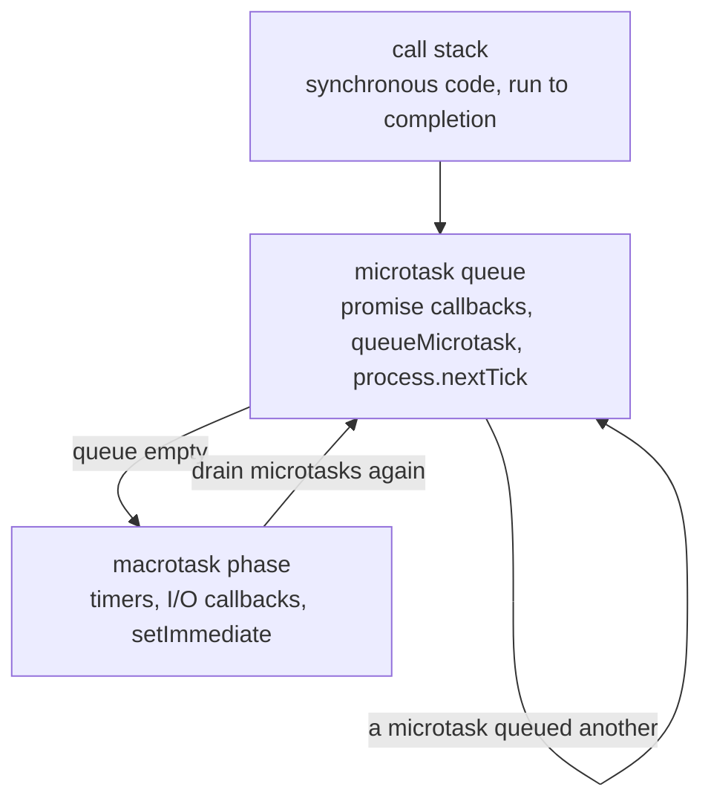

# The Event Loop, Promises & `async`/`await`

JavaScript runs your code on **one thread**. Everything that looks concurrent -
timers, I/O, promises, `await` - is a queue discipline on top of that single
thread, not extra threads. Understanding the queue explains why a resolved
promise still defers, why `setTimeout(fn, 0)` can fire 50ms late, and why one
synchronous loop can stall an entire server.

## The loop



The rule in one sentence: **run the current synchronous code to completion, then
drain the entire microtask queue, then run one macrotask, then drain microtasks
again — forever.**

A microtask that queues another microtask is drained in the same pass, which is
why an infinite chain of `.then()` can starve timers permanently.

<<< ../../examples/javascript/async/event-loop-order.mjs{js}

```
actual execution order:
  1. sync: script start
  2. sync: script end
  3. microtask: promise.then
  4. microtask: queueMicrotask
  5. microtask: process.nextTick
  6. macrotask: setImmediate
  7. macrotask: setTimeout(fn, 0)
```

| Queue | Members | Runs |
| --- | --- | --- |
| Microtask | `.then`/`catch`/`finally`, `await` resumption, `queueMicrotask` | fully drained after the current code and after every macrotask |
| `nextTick` | `process.nextTick` (Node only) | its own queue, drained before promise microtasks **in CommonJS** |
| Macrotask | `setTimeout`, `setInterval`, `setImmediate`, I/O callbacks | one phase per loop turn |

::: warning `process.nextTick` ordering is not portable
The output above shows `nextTick` running **last** among the microtasks, which
contradicts the usual "nextTick jumps the queue" summary. It is true in
CommonJS - but a top-level ESM body is itself evaluated inside a microtask, so
promise callbacks queued there are already pending by the time the `nextTick`
queue is reached. Never build ordering on it. Use `queueMicrotask`, which behaves
identically everywhere.
:::

`setTimeout(fn, 0)` and `setImmediate()` also race when scheduled from the main
module - their relative order genuinely is not guaranteed. Inside an I/O
callback, `setImmediate` always wins.

## Blocking the only thread

```
blocking the only thread:
  a 0ms timer actually fired after ~50ms,
  because a synchronous loop held the only thread the whole time.
```

A delay argument is a **minimum**, never a promise. The 50ms busy loop in the
example stands in for parsing a large JSON file, hashing a password, or sorting a
huge array - and in a server, that is 50ms in which *every* request is stalled,
not just the one that triggered it.

Fixes, in order of preference:

1. **Use the async API.** `fs/promises` rather than `readFileSync`,
   `crypto.scrypt` rather than `scryptSync`. Node's I/O happens on a thread pool;
   only your JavaScript is single-threaded.
2. **Move the work off-thread** - `node:worker_threads` for CPU work, a child
   process for something separable.
3. **Chunk it and yield**, with `await delay(0)` between slices, when the work
   must stay in-process.

## Promises and `async`/`await`

A promise is a value that will settle exactly once: **pending** → **fulfilled**
or **rejected**, never back. `async`/`await` is syntax over the same object -
an `async` function always returns a promise, and `await` suspends the function
while the rest of the program keeps running.

<<< ../../examples/javascript/async/promise-patterns.mjs{js}

### Sequential vs concurrent

```
sequential vs concurrent:
  three 60ms calls in a for-await loop: ~181ms
  the same three via Promise.all:      ~60ms
```

`await` inside a loop means "wait for each one". When the calls do not depend on
each other, that is pure latency for nothing. Start them all, then await:
`await Promise.all(items.map(work))`.

The inverse mistake exists too: firing 10,000 requests concurrently because
`map` made it easy. `Promise.all` cannot cap that - by the time it sees the
array, every promise in it is already running - so an unbounded list needs a
queue that takes *functions*:
[Promise Queues & Concurrency Limits](./promise-queues).

### Choosing a combinator

```
combinators:
  Promise.all rejected with: b failed
  allSettled -> fulfilled: ok@10ms
  allSettled -> rejected: bad failed
  Promise.race -> timed out
  Promise.any  -> mirror-2@15ms
```

| Combinator | Settles when | Use for |
| --- | --- | --- |
| `all` | all fulfil, or **first** rejection | independent work that must all succeed |
| `allSettled` | everything has settled; never rejects | batch jobs where partial failure is normal |
| `race` | first to settle, success **or** failure | timeouts, first-of-several |
| `any` | first to **succeed**; `AggregateError` if all fail | mirrors, fallbacks |

::: warning Rejection is not cancellation
When `Promise.all` rejects, the other promises keep running - nothing stops them,
their results are just ignored, and their later rejections become unhandled. If
the work should actually stop, it needs an `AbortSignal`.
:::

### Cancellation

```
cancellation:
  aborted: user navigated away
  combined signal fired: AbortError <- whichever reason came first
```

`AbortSignal` is the standard cancellation currency, accepted by `fetch`,
`node:timers/promises`, streams, and `events.on`:

- `AbortSignal.timeout(ms)` - the whole of request timeouts:
  `fetch(url, { signal: AbortSignal.timeout(2_000) })`.
- `AbortSignal.any([a, b])` - combine "user cancelled" with "took too long"; the
  first reason wins.
- `controller.abort(reason)` - the reason arrives on the rejection, so you can
  distinguish a deliberate cancel from a real failure.

The [TypeScript guide's cancellation page](/typescript/cancellation-and-signals)
covers the typed patterns and propagation through layers.

## Three ways to lose an error

```
losing errors:
  2. forEach + async callback returned with nothing done: []
  1. floating promise, caught late: floating failed
     Promise.all(map) waited: [10,30] <- push order is completion order
  3. `return promise` skipped its own try/catch: inner failed
```

**1. The floating promise.** Not awaited, not returned, no `.catch()`. The
rejection escapes to `process.on("unhandledRejection")` with no useful stack, and
since Node 15 that terminates the process by default. Either `await` it, `return`
it, or attach a `.catch()` - all three are fine; silence is not.

**2. An `async` callback passed to a non-promise-aware API.** `forEach` ignores
the returned promise, so the "loop" completes before any work does - note the
empty array in the output. Use `for...of` for sequential work or
`Promise.all(map)` for concurrent. The same trap applies to `sort`, `filter`, and
most event-emitter callbacks.

**3. `return somePromise` inside a `try`.** The function returns before the
promise settles, so the rejection happens *outside* the `try` and the `catch`
never fires. Write `return await` when the `try` block is meant to cover it -
this is exactly what ESLint's `no-return-await` rule used to get wrong.

## Wrapping errors instead of erasing them

```
error chaining:
  outer: could not load profile 7
  cause: profile-7 failed
```

`new Error("context", { cause: original })` keeps the original error and its
stack attached. Catching an error only to `throw new Error("failed")` destroys
the only information that would have told you why. More on error design in
[Errors & Graceful Shutdown](./errors-and-shutdown).

## Async iterators

`for await...of` consumes anything with `[Symbol.asyncIterator]`, and
`async function*` is the easy way to produce one. It is the right shape whenever
"give me everything" is served as "one chunk at a time":

<<< ../../examples/javascript/async/async-iterators.mjs{js}

```
streaming a paginated API:
  a  b  c  d  e

early exit:
  saw 1  saw 2  generator cleaned up on break
```

Two properties that make this more than syntax sugar:

- **Laziness.** Nothing is fetched until the consumer asks. The paginated example
  never holds more than one page in memory, however many pages there are.
- **Cleanup on `break`.** Leaving a `for await` loop early calls the generator's
  `.return()`, so a `finally` block runs and releases whatever it held open -
  a file handle, a cursor, a connection.

Node exposes async iteration on the things you would hope for: readable streams
(see [Streams & Buffers](./streams-and-buffers)), `readline`, and events via
`events.on`:

```
events.once as a promise: payload
events.on as an async iterator:
  tick 1  tick 2  tick 3
```

::: tip `for await` is sequential by design
That is correct for a stream and wrong for N independent promises. If the work
*starts* inside the loop body, you have serialised it. Starting it first with
`.map()` and then awaiting is the fix - which at that point is just
`Promise.all` with extra steps.
:::

## Summary

- One thread. Synchronous code runs to completion, then all microtasks, then one
  macrotask, then all microtasks again.
- A resolved promise still defers to the microtask queue; `setTimeout(fn, 0)` is
  a minimum delay, not a schedule.
- Prefer `queueMicrotask` to `process.nextTick` - the latter's ordering differs
  between CommonJS and ESM.
- Blocking work belongs in an async API, a worker thread, or chunks that yield.
- `await` in a loop serialises; `Promise.all(map)` parallelises; `allSettled`
  when partial failure is acceptable.
- Rejection is not cancellation - use `AbortSignal`, and combine reasons with
  `AbortSignal.any`.
- Never float a promise, never pass an `async` callback to `forEach`, and use
  `return await` inside a `try`.
- `async function*` gives lazy, cancellable streaming with real cleanup on
  `break`.
