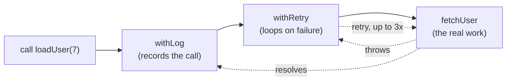

# Functions, Arrow Chaining & Composition

A function in JavaScript is a value: you can store it, pass it, return it, and
build new functions out of old ones. Two habits follow from that, and they are
the two halves of this page - **chaining arrows** to produce configured
functions, and **passing functions** into other code as arguments.

Both are everywhere in real code (`map`, `then`, `addEventListener`, middleware,
React props), and both have a small set of traps that account for most of the
confusion.

## How a chain of arrows parses

`=>` is right-associative, so in `(a) => (b) => a + b` the *body* of the first
arrow is the second arrow. Nothing clever is happening - each call peels off one
layer:

| Expression | You get back |
| --- | --- |
| `addChained` | the outer function |
| `addChained(2)` | a **function** that adds 2 - the `2` is captured in a closure |
| `addChained(2)(3)` | `5` |

<<< ../../examples/javascript/language/arrow-chaining.mjs{js}

```
how a chain parses:
  addVerbose(2)(3) ..... 5
  addChained(2)(3) ..... 5
  addChained(2) ........ function <- one call returns a function, not a number
  => { id } ............ undefined <- block body, no return
  => ({ id }) .......... {"id":1} <- parens make it an object
```

::: warning `=>` followed by `{` is a block, not an object
`(id) => { id }` returns `undefined`: the parser reads `{` as the start of a
function body, so `id` is just a statement inside it. To return an object
literal, wrap it in parentheses - `(id) => ({ id })`. This one costs everybody
ten minutes exactly once.
:::

## Currying and partial application

Splitting a function's arguments across arrows lets a caller supply what it
knows now and get back a function waiting for the rest. That returned function
is a value with a name, which is the entire point:

```
currying:
  filter + map ......... 120, 45
  named partial ........ 2 shipped orders
  config first, data last EUR 1.20 / EUR 0.80 / EUR 0.45 / EUR 2.00
```

`isStatus("shipped")` and `pluck("total")` each return exactly the one-argument
function `filter` and `map` want, so the call site reads as a sentence:

```js
orders.filter(isStatus("shipped")).map(pluck("total"));
```

**Take configuration first and data last.** That order is what makes the partial
application useful: `formatMoney("EUR ")` leaves a function of one value, which
slots straight into a `map`. Reverse the parameters and you would have to write
a wrapper arrow at every call site to get the same effect.

::: tip Don't curry everything
Currying pays when the first arguments are stable across many calls
(configuration, a key, a comparator) and the last one varies per item. A
two-argument function called once with both arguments should stay a
two-argument function - `add(2, 3)` is clearer than `add(2)(3)` and easier to
type in TypeScript.
:::

## `pipe` and `compose`

Both are one-liners over `reduce`, and the difference is only direction:

```js
const pipe    = (...fns) => (input) => fns.reduce((value, fn) => fn(value), input);
const compose = (...fns) => (input) => fns.reduceRight((value, fn) => fn(value), input);
```

| | Reads | `slugify` becomes |
| --- | --- | --- |
| `pipe(trim, lower, dashes)` | left to right, in execution order | "trim, then lower, then dashes" |
| `compose(dashes, lower, trim)` | right to left, like `f(g(x))` | the same function, written backwards |

```
pipe / compose:
  pipe ................. hello-arrow-world
  compose .............. hello-arrow-world
  same steps, reversed . true
```

Prefer `pipe` - it matches reading order, and it matches how a method chain
already reads. And prefer neither when there are only two steps:
`dashes(lower(s))` needs no helper at all.

## Wrapper chains: `(config) => (fn) => (...args)`

This shape is the one worth memorising. It takes options, then the function to
wrap, then returns a **drop-in replacement** with the same signature - which is
how retries, logging, caching, timeouts and auth checks get added to a function
without touching it:

```js
const withRetry = (attempts) => (fn) => async (...args) => { /* ... */ };
```



```
wrapper chains:
  result ............... {"id":7,"name":"ada"}
  log entries .......... loadUser <- logging outside retry sees one call
  swapped order ........ attempt, attempt, attempt <- logging inside retry sees each attempt
  piped wrapper ........ {"id":9,"name":"ada"}
  orNull(...) .......... null <- error became a value
```

**Wrapper order is a real decision, not a style choice.** The same two wrappers
in the opposite order answer different questions: log outside retry to count
*logical* calls, log inside to see every *attempt*. The same applies to caching
around a retry (cache the successful result) versus retry around a cache (retry
the cache lookup itself).

Because each `withX(config)` is already a `fn -> fn` transform, `pipe` composes
the stack directly:

```js
const harden = pipe(withRetry(3), withLog("harden"));
const loadUser = harden(fetchUser);
```

## Where chaining stops paying

Every arrow is a level of indirection for the next reader and an anonymous frame
in the stack trace:

```js
// ❌ Four positional arguments with no names anywhere.
const terse = (a) => (b) => (c) => (d) => a + b + c + d;
terse(1)(2)(3)(4);

// ✅ Name the intermediate function when it means something.
const priceFor = (base) => {
  const withTax = (rate) => Math.round(base * (1 + rate));
  return withTax;
};
```

Rules of thumb: two layers is normal, three is the ceiling, and any layer worth
reusing deserves a name. If you cannot name the intermediate function, that is
usually a sign the split is arbitrary.

## Passing functions as arguments

The other half. Passing `fn` hands over the function; passing `fn()` hands over
its *result*; passing `() => fn(x)` hands over a **thunk** - a zero-argument
function that defers the call with its arguments already baked in.

| You write | The callee receives | Use when |
| --- | --- | --- |
| `run(fetchUser)` | the function, called with whatever `run` supplies | `run` knows the arguments |
| `run(fetchUser(id))` | a promise that is **already running** | almost never what you meant |
| `run(() => fetchUser(id))` | a thunk `run` can call later, twice, or never | `run` controls *when* - queues, retries, `useMemo` |

<<< ../../examples/javascript/language/passing-functions.mjs{js}

```
pass vs call:
  apply(greet, 'ada') ... hello ada <- greet, no parens: the function is the argument
  runLater(() => ...) ... hello grace <- a thunk defers the call and pre-binds the args
  apply(greet('alan')) .. string <- a string; nothing left to call
```

### The extra-arguments trap

Array callbacks are invoked with `(element, index, array)`, not just
`(element)`. A function that accepts a second parameter silently receives the
index:

```
extra arguments:
  map(parseInt) ......... 1, NaN, 3 <- parseInt(str, radix) reads the index as the radix
  map(Number) ........... 1, 7, 11 <- Number takes exactly one argument
  map((s) => ...) ....... 1, 7, 11 <- the wrapping arrow fixes the arity
  map(round) ............ 1, 5.7 <- the index landed in `digits`
  map((n) => round(n, 1)) 1.2, 5.7
```

`["1", "7", "11"].map(parseInt)` is the famous one: it becomes
`parseInt("1", 0)`, `parseInt("7", 1)`, `parseInt("11", 2)` - radix 0 defaults to
10, radix 1 is invalid, and `"11"` in base 2 is 3.

**Point-free style is only safe when the arities match.** Pass a function
reference when it takes exactly one argument (`map(Number)`,
`filter(Boolean)`); wrap it in an arrow the moment it has optional parameters.

### A passed method loses its receiver

```
losing `this`:
  bare method ........... TypeError: this is undefined
  wrapped in an arrow ... 2 <- clearest fix
  .bind(counter) ........ 2 <- same result, bound once
```

`callTwice(counter.increment)` passes the function without the object, so `this`
is `undefined` by the time it runs. Wrap it (`() => counter.increment()`) or
bind it. [Scope, Closures & `this`](./scope-and-closures) has the full table of
call forms and the class-field alternative.

### Take a function, not a flag

A function parameter is how you hand a decision back to the caller. A comparator
factory beats a `sortBy: string` argument and a `switch`:

```
function parameters:
  sort by name .......... ada, alan, grace
  sort by age, desc ..... grace, alan, ada
  injected clock (real) . true <- Date.now() is well past 1000
  injected clock (fake) . false <- deterministic in a test
```

`by("age")` builds the comparator, and `desc(...)` is a chained arrow that
*transforms* a comparator into its reverse - composition applied to functions
you were already passing around.

The last two lines are the same idea used for testability: `isExpired` takes its
clock as a parameter with a real default, so a test passes `() => 500` instead
of mocking the module. **Injecting a function is the cheapest test seam there
is**, and it needs no framework.

### Function identity

Every arrow *expression* creates a new function object. Anything that
de-duplicates, unsubscribes or caches by reference needs a stable one:

```
function identity:
  (() => {}) === (() => {}) false
  leftover listeners .... 1 <- the inline arrow could never be removed
  memoized, called twice  81 (underlying calls: 1)
```

```js
// ❌ The listener can never be removed - a different function object each time.
emitter.on("tick", () => refresh());
emitter.off("tick", () => refresh());

// ✅ One reference, held.
const onTick = () => refresh();
emitter.on("tick", onTick);
emitter.off("tick", onTick);
```

The same rule explains `removeEventListener` failing silently, and why React's
`useCallback` exists at all - see
[When to useEffect / useCallback / useMemo](/react/hooks-when-to-use).

### Name the function you pass

Inline arrows are right for one-liners. Once there is logic in there, extract and
name it: the name documents the intent, appears in stack traces and profiles, and
makes the predicate reusable.

```js
users.filter((u) => u.active && u.role === "admin"); // fine, once
users.filter(isActiveAdmin);                         // better, everywhere else
```

::: tip Typing these in TypeScript
Curried and wrapper functions are where generics earn their keep - a wrapper
must preserve its target's parameters and return type
(`<A extends unknown[], R>(fn: (...args: A) => R) => (...args: A) => R`). See
[Function Signatures & Overloads](/typescript/function-signatures) and
[Generics In-Depth](/typescript/generics-in-depth). React-specific chaining of
event handlers lives in
[Event Handlers & Function Chaining](/react/event-handlers).
:::

## Summary

- `(a) => (b) => ...` is just nesting: each call returns the next function, with
  the earlier arguments captured in closures.
- `=> {` starts a block. Return an object literal with `=> ({ ... })`.
- Curry with **configuration first, data last**, so the partially applied
  function drops straight into `map`/`filter`/`sort`.
- `pipe` reads in execution order; `compose` reads like `f(g(x))`. Skip both for
  two steps.
- `(config) => (fn) => (...args)` is the wrapper shape for retry, logging and
  caching - and the order you stack them in changes what they measure.
- Two layers of arrows is normal, three is the ceiling, and anything reusable
  gets a name.
- Pass `fn` to hand over the function, `() => fn(x)` to hand over a deferred
  call, and `fn(x)` only when you mean the result.
- Array callbacks get `(element, index, array)`: point-free only works when the
  arities match, which is why `map(parseInt)` returns `1, NaN, 3`.
- A method passed as a bare callback loses `this`.
- Every arrow expression is a new object; hold a reference if anything
  unsubscribes or caches by identity.
