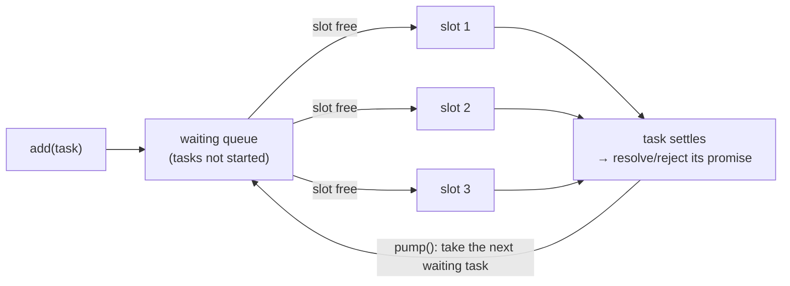

# Promise Queues & Concurrency Limits

`Promise.all(items.map(work))` is the right answer for three items and the wrong
answer for three thousand. It has no ceiling: every task starts in the same tick,
so the number of open sockets, in-flight database queries and buffered responses
is whatever `items.length` happens to be that day. It works in development
against 12 rows and falls over in production against 12,000.

A **promise queue** puts a bound on how many tasks run at once, without changing
the results you get back.

## The anti-pattern

```js
// ❌ Concurrency = however many items the caller happened to pass.
const results = await Promise.all(userIds.map((id) => fetch(`/api/users/${id}`)));
```

Four things go wrong at scale, and none of them show up in a small test:

| What breaks | Why |
| --- | --- |
| Sockets / file handles | Every request opens one at the same moment; `EMFILE` and `ECONNRESET` follow. |
| The remote API | 3,000 requests in one tick is a burst no rate limiter will forgive - `429` for everyone, including your other traffic. |
| Memory | Every response body is held at once, because nothing settles until all of them do. |
| The database | A connection pool of 10 handed 3,000 queries queues them *inside the driver*, where you cannot see the backlog, cancel it, or report progress. |

Note the last one especially: without an explicit queue you still have a queue.
It just lives somewhere you don't control.

## The queue

The whole thing is about forty lines, which is why reaching for a dependency
here is optional:

<<< ../../examples/javascript/async/promise-queue.mjs{js}



::: tip `add` takes a function, not a promise
`queue.add(fetchUser(id))` is a bug that looks like working code: `fetchUser(id)`
has **already started** by the time `add` receives its promise, so the queue
bounds nothing. Only `queue.add(() => fetchUser(id))` can be deferred. This is
the same reason `Promise.all` cannot limit concurrency - by the time it sees the
array, everything in it is running.
:::

## What it buys you, measured

<<< ../../examples/javascript/async/promise-queue-usage.mjs{js}

```
unbounded vs queued (24 tasks, 20ms each):
  Promise.all(map):     max in flight 24, ~21ms
  queue, concurrency 4: max in flight 4, ~121ms
  queue, concurrency 8: max in flight 8, ~60ms
  the queue trades wall time for a bound on resources - that is the whole deal
```

That trade is the entire decision. Unbounded is fastest **when nothing is
contended** - and in production something always is, at which point 24 parallel
requests are slower than 4, not faster, because they queue up somewhere less
convenient. Pick the concurrency from what the *downstream* resource can take:
the connection pool size, the API's documented limit, the number of CPU cores.

### Results stay in input order

```
completion order is not result order:
  finished in order: [1,3,2,4,0,5]
  results returned:  #0 (50ms), #1 (10ms), #2 (40ms), #3 (5ms), #4 (30ms), #5 (15ms)
```

`mapConcurrent` builds an array of promises in input order and hands it to
`Promise.all`, so completion order never leaks into the output. Collecting
results by pushing into an array from inside the tasks - the obvious-looking
alternative - gives you completion order instead, which is a bug that only
appears when one item happens to be slow.

### A rejection does not stop the queue

```
one task fails:
  mapConcurrent rejected with: task 2 failed
  ...but 5 other tasks still ran to completion - rejecting is not cancelling
  mapSettled kept the successes: [0,10,"ERR",30,40,50]
```

`Promise.all` rejecting means *you* stop waiting - the queue keeps draining and
the remaining tasks still run. For batch work, where one bad row should not throw
away 5,000 good ones, use the `allSettled` twin and report the failures:

```js
const results = await mapSettled(rows, importRow, { concurrency: 8 });
const failed = results.filter((r) => r.status === "rejected");
console.warn(`${failed.length} of ${rows.length} rows failed`);
```

To actually *stop* on the first failure you need cancellation, which is a signal,
not an exception.

### Aborting drops what has not started

```
abort mid-run:
  4 of 24 tasks ever started
  20 were dropped while still queued, reason: user cancelled
```

A queue makes cancellation dramatically cheaper than it is with `Promise.all`: 20
of the 24 tasks were still waiting, so aborting meant *never calling them at
all*. The four already running have to observe the signal themselves - pass it
into `fetch`, into `node:timers/promises`, into whatever does the work. The queue
cannot claw back a task it has already handed a slot to.

### `concurrency: 1` is a mutex

```
concurrency 1 = a serial queue (the fix for interleaved writes):
  four unqueued deposits of 1,2,3,4 -> balance 4 (expected 10): lost updates
  the same four through concurrency: 1 -> balance 10
```

Any read-modify-write with an `await` in the middle can interleave: every caller
reads the balance before any of them writes it back, so four deposits produce
one. JavaScript's single thread does not save you here - it guarantees no two
*statements* interleave, not that no two `async` functions do.

A queue with `concurrency: 1` serialises the whole critical section, and reads
better than a hand-rolled `isRunning` flag:

```js
const writes = new PromiseQueue({ concurrency: 1 });
export const saveSettings = (patch) => writes.add(() => writeFile(path, JSON.stringify(patch)));
```

### `onIdle()` for work nobody awaits

```
fire-and-forget with a drain point:
  queued 9 jobs -> running 3, pending 6
  after onIdle() -> running 0, pending 0
```

Background jobs - cache warming, analytics flushes, thumbnail generation - are
queued without anyone holding their promises. `onIdle()` is the join point that
makes them awaitable anyway: `await queue.onIdle()` before `process.exit`, in a
test's teardown, or in a `SIGTERM` handler. See
[Errors & Graceful Shutdown](./errors-and-shutdown) for the shutdown sequence
this belongs in.

## Choosing the tool

| Need | Tool |
| --- | --- |
| A handful of independent calls | `Promise.all` - a queue would be ceremony |
| N calls where N is user- or data-driven | a queue with a fixed concurrency |
| Partial failure is normal | `mapSettled` / `Promise.allSettled` |
| One at a time, in order | queue with `concurrency: 1` |
| Bound *requests per second*, not in-flight count | a [rate limiter](./timers-and-scheduling#rate-limiting) - a different limit |
| Millions of items, or items arriving over time | a [stream](./streams-and-buffers) with backpressure, not an array |

::: warning A concurrency limit is not a rate limit
`concurrency: 2` against an endpoint that answers in 5ms is 400 requests per
second. If the API's limit is "100 per minute", the queue will not save you -
that needs a limiter that counts calls per unit of *time*. The two are
complementary, and [Timers, Rate Limits & Scheduling](./timers-and-scheduling)
shows them stacked.
:::

## Summary

- `Promise.all(map)` sets concurrency to `items.length`. That is a decision, and
  usually not one you made deliberately.
- A queue takes **functions**, not promises - a promise you already hold is
  already running.
- Bound the concurrency by the contended resource: pool size, API limit, cores.
- Results stay in input order; only completion order changes.
- Rejection is not cancellation. `allSettled` to keep the successes,
  `AbortSignal` to actually stop.
- Aborting a queue is cheap because most tasks have not started yet.
- `concurrency: 1` is a mutex - the fix for interleaved read-modify-write.
- `onIdle()` makes fire-and-forget work awaitable at shutdown.
