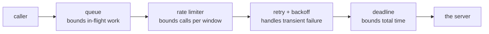

# Timers, Rate Limits & Scheduling

Every timing bug in JavaScript follows from one sentence: **a delay argument is a
minimum, not a schedule.** `setTimeout(fn, 20)` promises the callback will not
run *before* 20ms. It promises nothing about how much later, and nothing at all
about the tick after that.

That single fact explains repeated timers that drift, intervals that overlap
their own work, countdowns that end up minutes wrong, and retry storms that take
a service down twice.

## Repeating timers: which one drifts

<<< ../../examples/javascript/async/timers-and-scheduling.mjs{js}

```
10 ticks of 20ms, each doing 6ms of work (ideal: 200ms):
  setInterval:            ~208ms  (drift +8ms)
  chained setTimeout:     ~262ms  (drift +62ms)
  self-correcting chain:  ~205ms  (drift +5ms)
```

The result contradicts the usual folklore. `setInterval` is the one people call
unreliable, but it schedules on a **fixed grid**: the runtime knows when each
tick was due, so work inside the callback is absorbed rather than added on. The
naive recursive `setTimeout` is what drifts - it asks for a full period *after*
the work finishes, so every tick is late by the work it just did, and the error
accumulates. Six milliseconds of work per tick became 62ms of drift in two
tenths of a second; over an hour it is minutes.

The self-correcting chain fixes it by scheduling against the **original start
time** rather than against "now":

```js
setTimeout(handler, Math.max(0, start + (tick + 1) * period - performance.now()));
```

A slow tick shortens the next wait instead of pushing everything back.

## An interval does not wait for async work

```
when the work outlasts the period (30ms of work, 10ms interval):
  setInterval + async callback: up to 4 runs in flight at once
  timeout chained after the work: up to 1 in flight, 6 runs in ~241ms
```

`setInterval(async () => …, 10)` fires every 10ms whether or not the previous
call has finished. With work that takes 30ms, four copies end up in flight at
once - hammering the endpoint you were politely polling, and racing each other
to write the result.

There is no interval option that fixes this. The fix is to stop using an
interval and chain the next timeout *after* the work settles, which is exactly
what [`usePolling`](/react/advanced-hook-chaining#interval-null-is-the-pause-button)
does with an abort, and what the self-correcting loop above does with a
deadline. An `isRunning` boolean guard is the common patch; it silently *drops*
ticks instead of spacing them, which is a different behaviour than the one you
asked for.

## Debounce, throttle, rate limit

```
20 events over ~200ms (one every 10ms):
  raw handler:      20 calls
  debounce(50ms):   1 call  -> [19] (only the last)
  throttle(50ms):   5 calls -> [0,4,9,14,19] (spread out, last kept)
```

Three tools that all "call it less", answering three different questions:

| Policy | Question it answers | Fires |
| --- | --- | --- |
| **Debounce** | "has it stopped?" | once, `wait` after the **last** call |
| **Throttle** | "how often at most?" | at most once per `wait`, leading + trailing |
| **Rate limit** | "how many per window?" | up to N per interval, then queues the rest |

Debounce is right for search-as-you-type and autosave, where only the final
value matters. It is wrong for anything the other side is waiting on: a user who
types continuously for a minute sends *nothing* for a minute. Throttle keeps a
steady trickle, which is what presence indicators, live cursors and progress
reporting want. Both implementations above keep the newest arguments for the
trailing call, so the last event of a burst is never lost.

::: tip Throttling by frames, not milliseconds
For scroll, `pointermove` and resize the correct interval is not a number of
milliseconds - it is one repaint. `requestAnimationFrame` is the right clock, and
[frame-throttled callbacks](/react/advanced-hook-chaining#frame-throttling-the-right-tool-for-scroll-and-pointer-events)
show the React version.
:::

## Count the clock, not the ticks

```
a countdown that survives a stalled thread (200ms, 20ms ticks):
  ticks that actually fired: 7 of the expected 10
  counting ticks says 60ms left; the clock says 0ms
```

An 80ms stall - a GC pause, a long render, a backgrounded tab - cost three of the
ten ticks. Timers do **not** catch up: missed ticks are gone, not queued. So a
countdown that decrements a counter per tick ends up 60ms wrong after one stall,
and a background tab throttled to one tick per minute ends up hours wrong.

The rule is to make every tick **derive** its value from the clock rather than
accumulate:

```js
// ❌ drifts by exactly as much as the timers do
remaining -= 1000;

// ✅ correct no matter how many ticks were missed or how late they were
const remaining = Math.max(0, endsAt - Date.now());
```

The timer then only decides *how often you re-render*, not *what the value is* -
and being late costs a stale frame instead of a wrong answer.

## Which clock to measure with

```
Date.now() vs performance.now():
  Date.now():        52ms       (wall clock - can jump backwards on an NTP sync)
  performance.now(): 51.263ms  (monotonic, sub-millisecond - use this for durations)
```

`Date.now()` is the wall clock: it is what you want for *deadlines* ("this
expires at 14:00") and for anything the user sees. It can also jump - forwards or
backwards - when the system clock syncs, so a duration measured with it can come
out negative. `performance.now()` is monotonic and sub-millisecond: use it for
"how long did this take" and for scheduling relative to a start.

## Rate limiting

A concurrency limit and a rate limit are different limits, and APIs bill on the
second one. Two in-flight requests against a 5ms endpoint is 400 requests per
second - a `concurrency: 2` queue will not keep you under "100 per minute".

<<< ../../examples/javascript/async/rate-limit-and-retry.mjs{js}

```
rate limiter: 3 calls per 100ms window
   call 0 at    0ms
   call 1 at    0ms
   call 2 at    0ms
   call 3 at  200ms
   call 4 at  100ms
   call 5 at  100ms
   call 6 at  100ms
   call 7 at  200ms
   call 8 at  200ms
   3 go immediately, the rest wait for a slot to age out of the window
```

Three go straight through, the rest wait for a slot to age out of the sliding
window. Look at `call 3`, though: it ran in the *third* window while calls 4-6
ran in the second. Waiters wake together and take slots in whatever order the
runtime resumes them, so **this limiter is not FIFO**. That is usually fine for
background work and unacceptable for anything user-facing - if fairness matters,
feed the tasks through a [`PromiseQueue`](./promise-queues) and rate-limit inside
it, so ordering is decided by one place instead of by the scheduler.

## Retries: backoff, and why jitter is not optional

```
retry with backoff:
   attempt 0 failed with "503 (attempt 1)", sleeping ~9ms
   attempt 1 failed with "503 (attempt 2)", sleeping ~37ms
   succeeded after 3 calls: ok
   "400 bad request" was retried 1 time(s) - a 4xx is not a blip
```

Two rules the loop encodes. **Back off exponentially**, because a service that
just failed needs less traffic, not the same amount immediately. And **do not
retry what cannot succeed** - a `400`, a `401`, a validation error and a
deliberate abort are all permanent as far as retrying goes. Retrying them turns
one wasted call into five.

```
why jitter (5 clients that failed at the same instant, attempt 1):
   no jitter:   200ms, 200ms, 200ms, 200ms, 200ms  <- one synchronised spike
   full jitter: 189ms, 67ms, 167ms, 101ms, 36ms  <- spread across the window
```

Every client that failed together backs off together. Without jitter they all
sleep exactly 200ms and retry in the same millisecond, recreating the spike that
caused the outage - and again after 400ms, and again after 800ms. **Full
jitter** - a random point in `[0, exponential)` rather than the exponential
itself - spreads them across the window. The jittered numbers differ on every
run, which is the entire point.

## Deadlines: one attempt vs the whole operation

```
per-attempt timeout vs overall deadline:
   one attempt, 30ms cap -> AbortError
   10 attempts allowed, but the 100ms budget stopped it after 3 (~101ms): TimeoutError
```

`AbortSignal.timeout(ms)` caps **one attempt**. A retry loop wrapped around it
has no bound at all: ten attempts of 30 seconds each is a five-minute request as
far as the user is concerned. The overall budget is a second signal, and
`AbortSignal.any([attempt, deadline])` lets a call answer to both - whichever
fires first wins, and the reason tells you which.

Note the two error names in the output: the per-attempt cap surfaced as
`AbortError` (Node's timers reject with that), while the deadline surfaced as
`TimeoutError`, because `retry` deliberately re-throws `signal.reason`. Deciding
that "why did this stop" has exactly one answer, wherever it stopped, is worth
the three extra lines.

## Stacking the policies

```
stacked: queue -> limiter -> retry -> deadline
   6 resources fetched in ~213ms
   9 requests actually hit the server (6 + 3 retries)
   order: queue bounds sockets, limiter bounds request rate, retry handles blips
```

The order matters, and it is the same every time:



Retries live **inside** the limiter, not outside it: a retry is another request
and must be counted as one, or a failing service gets a burst of retries at
exactly the moment it is least able to take them. The deadline wraps the whole
operation so the retries cannot outlive the user's patience.

## Summary

- A delay is a minimum. Timers fire late, never early, and never catch up.
- `setInterval` keeps a fixed grid; a **naive chained `setTimeout` drifts** by
  the work it does. Schedule against the original start time to fix it.
- An interval does not wait for async work - chain the next timeout after the
  work settles instead.
- Debounce = "has it stopped", throttle = "how often at most", rate limit =
  "how many per window". They are not interchangeable.
- Derive values from the clock; never accumulate them per tick.
- `performance.now()` for durations, `Date.now()` for deadlines and display.
- Exponential backoff with **full jitter**, and never retry a permanent error.
- Cap the attempt *and* the operation: `AbortSignal.any([timeout, deadline])`.
- Stack them queue → limiter → retry → deadline, with retries counted by the
  limiter.
