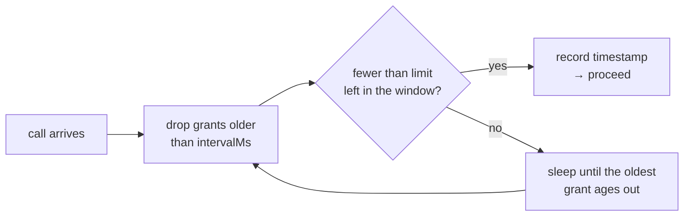
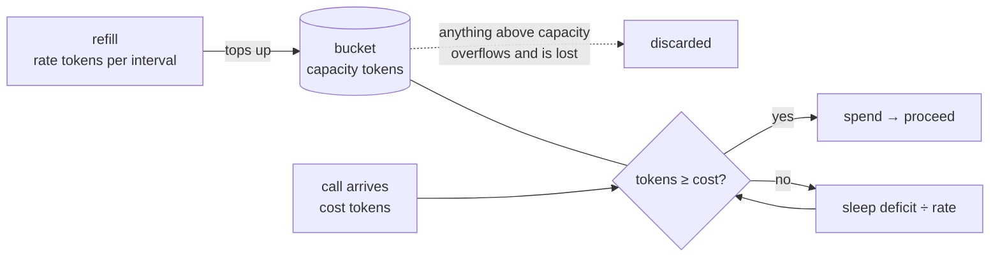
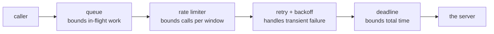

# Timers, Rate Limits & Scheduling

Every timing bug in JavaScript follows from one sentence: **a delay argument is a
minimum, not a schedule.** `setTimeout(fn, 20)` promises the callback will not
run *before* 20ms. It promises nothing about how much later, and nothing at all
about the tick after that.

That single fact explains repeated timers that drift, intervals that overlap
their own work, countdowns that end up minutes wrong, and retry storms that take
a service down twice.

## Repeating timers: which one drifts

<<< ../../examples/javascript/async/timers-and-scheduling.mjs{js}

```
10 ticks of 20ms, each doing 6ms of work (ideal: 200ms):
  setInterval:            ~208ms  (drift +8ms)
  chained setTimeout:     ~262ms  (drift +62ms)
  self-correcting chain:  ~205ms  (drift +5ms)
```

The result contradicts the usual folklore. `setInterval` is the one people call
unreliable, but it schedules on a **fixed grid**: the runtime knows when each
tick was due, so work inside the callback is absorbed rather than added on. The
naive recursive `setTimeout` is what drifts - it asks for a full period *after*
the work finishes, so every tick is late by the work it just did, and the error
accumulates. Six milliseconds of work per tick became 62ms of drift in two
tenths of a second; over an hour it is minutes.

The self-correcting chain fixes it by scheduling against the **original start
time** rather than against "now":

```js
setTimeout(handler, Math.max(0, start + (tick + 1) * period - performance.now()));
```

A slow tick shortens the next wait instead of pushing everything back.

## An interval does not wait for async work

```
when the work outlasts the period (30ms of work, 10ms interval):
  setInterval + async callback: up to 4 runs in flight at once
  timeout chained after the work: up to 1 in flight, 6 runs in ~241ms
```

`setInterval(async () => …, 10)` fires every 10ms whether or not the previous
call has finished. With work that takes 30ms, four copies end up in flight at
once - hammering the endpoint you were politely polling, and racing each other
to write the result.

There is no interval option that fixes this. The fix is to stop using an
interval and chain the next timeout *after* the work settles, which is exactly
what [`usePolling`](/react/advanced-hook-chaining#interval-null-is-the-pause-button)
does with an abort, and what the self-correcting loop above does with a
deadline. An `isRunning` boolean guard is the common patch; it silently *drops*
ticks instead of spacing them, which is a different behaviour than the one you
asked for.

## Debounce, throttle, rate limit

```
20 events over ~200ms (one every 10ms):
  raw handler:      20 calls
  debounce(50ms):   1 call  -> [19] (only the last)
  throttle(50ms):   5 calls -> [0,4,9,14,19] (spread out, last kept)
```

Three tools that all "call it less", answering three different questions:

| Policy | Question it answers | Fires |
| --- | --- | --- |
| **Debounce** | "has it stopped?" | once, `wait` after the **last** call |
| **Throttle** | "how often at most?" | at most once per `wait`, leading + trailing |
| **Rate limit** | "how many are we allowed?" | up to the allowance, then queues the rest ([two ways to count it](#rate-limiting)) |

Debounce is right for search-as-you-type and autosave, where only the final
value matters. It is wrong for anything the other side is waiting on: a user who
types continuously for a minute sends *nothing* for a minute. Throttle keeps a
steady trickle, which is what presence indicators, live cursors and progress
reporting want. Both implementations above keep the newest arguments for the
trailing call, so the last event of a burst is never lost.

::: tip Throttling by frames, not milliseconds
For scroll, `pointermove` and resize the correct interval is not a number of
milliseconds - it is one repaint. `requestAnimationFrame` is the right clock, and
[frame-throttled callbacks](/react/advanced-hook-chaining#frame-throttling-the-right-tool-for-scroll-and-pointer-events)
show the React version.
:::

## Count the clock, not the ticks

```
a countdown that survives a stalled thread (200ms, 20ms ticks):
  ticks that actually fired: 7 of the expected 10
  counting ticks says 60ms left; the clock says 0ms
```

An 80ms stall - a GC pause, a long render, a backgrounded tab - cost three of the
ten ticks. Timers do **not** catch up: missed ticks are gone, not queued. So a
countdown that decrements a counter per tick ends up 60ms wrong after one stall,
and a background tab throttled to one tick per minute ends up hours wrong.

The rule is to make every tick **derive** its value from the clock rather than
accumulate:

```js
// ❌ drifts by exactly as much as the timers do
remaining -= 1000;

// ✅ correct no matter how many ticks were missed or how late they were
const remaining = Math.max(0, endsAt - Date.now());
```

The timer then only decides *how often you re-render*, not *what the value is* -
and being late costs a stale frame instead of a wrong answer.

## Which clock to measure with

```
Date.now() vs performance.now():
  Date.now():        52ms       (wall clock - can jump backwards on an NTP sync)
  performance.now(): 51.263ms  (monotonic, sub-millisecond - use this for durations)
```

`Date.now()` is the wall clock: it is what you want for *deadlines* ("this
expires at 14:00") and for anything the user sees. It can also jump - forwards or
backwards - when the system clock syncs, so a duration measured with it can come
out negative. `performance.now()` is monotonic and sub-millisecond: use it for
"how long did this take" and for scheduling relative to a start.

## Rate limiting

A concurrency limit and a rate limit are different limits, and APIs bill on the
second one. Two in-flight requests against a 5ms endpoint is 400 requests per
second - a `concurrency: 2` queue will not keep you under "100 per minute".

Rate limiters come in two families, and picking between them is really a
decision about **bursts**: whether time you did not use is lost or saved.

| | **Time window** | **Token bucket** |
| --- | --- | --- |
| Counts | *events* inside a span of time | *credit*, refilled continuously and spent per call |
| Configured with | one number: N per interval | two: capacity (burst) and refill rate |
| After an idle hour | nothing saved - still N in the next window | the bucket filled up: a full burst is allowed |
| Calls of different cost | can't express it; a call is a call | `take(5)` for the expensive endpoint |
| State per key | a timestamp per grant, `O(N)` | two numbers, `O(1)` |
| Guarantee | never more than N in **any** window | average rate `r`, burst up to `capacity` |
| Fits | a contract quoted literally as "N per minute" | anything with `X-RateLimit-Remaining`; most cloud APIs |

### Time window: count the events

The limiter keeps the timestamps of recent grants. A call is allowed when fewer
than `limit` of them are still inside the window; otherwise it sleeps until the
oldest one ages out.



### Token bucket: spend credit that refills

A bucket holds up to `capacity` tokens and is topped up at a fixed rate. Each
call spends one (or several); a call that cannot pay waits exactly as long as
its missing tokens take to arrive. Tokens that would overflow a full bucket are
discarded - that cap is what stops an idle client from saving up an unbounded
burst.



Note what is *not* in that picture: a timer. The bucket is refilled lazily, by
deriving its level from the clock whenever someone looks at it - the same rule
as [counting the clock, not the ticks](#count-the-clock-not-the-ticks). An
interval that added tokens would burn CPU on every idle limiter, drift, and stop
refilling in a backgrounded tab.

<<< ../../examples/javascript/async/rate-limiter.mjs{js}

### The same traffic through both

Both limiters below are set to the *same* sustained rate, so every difference in
the output comes from the algorithm rather than the numbers:

<<< ../../examples/javascript/async/rate-limiter-comparison.mjs{js}

```
9 calls arriving at once, both limiters set to 3 per 100ms:
   time window: 0ms 0ms 0ms 100ms 100ms 100ms 200ms 200ms 200ms
   token bucket: 0ms 0ms 0ms 30ms 70ms 100ms 130ms 170ms 200ms
   the window releases in batches of 3; the bucket trickles one per ~33ms
```

Same rate, same finish time, completely different shape:

```
time window   3 . . . . . . . . . 3 . . . . . . . . . 3     <- batches
token bucket  3 . . 1 . . . 1 . . 1 . . 1 . . . 1 . . 1     <- trickle
              |         |         |         |         |
              0        50       100       150       200 ms
```

The window limiter is **bursty by construction**: it grants the whole allowance
the instant the window rolls, so the server sees a spike every interval. The
bucket spreads the same calls out, because credit arrives continuously rather
than all at once. For a downstream service, the second shape is much kinder -
and if you want it perfectly smooth, `capacity: 1` removes bursting entirely:

```
capacity 1 = no burst at all, just even spacing (1 per 20ms):
   0ms 20ms 40ms 60ms 80ms 100ms
   this is the 'leaky bucket' shape: smooth output, zero tolerance for bursts
```

### Idle time: lost or saved

```
after idling for 300ms, how many of 10 calls go straight through:
   time window (3 per 100ms):          3 of 10
   token bucket (cap 10, 3 per 100ms): 9 of 10
   the window forgets idle time; the bucket saved it up as burst credit
```

This is the difference that decides most real choices. A window limiter has no
memory of the quiet: a client that sent nothing for an hour still gets 3 calls in
the next 100ms. The bucket accrued a token per 33ms of silence, so the same
client opens with a 9-call burst and *then* settles to the sustained rate.

That is usually what you want for interactive work - a user who has been idle can
load a page's worth of requests immediately - and exactly what you do not want in
front of a fragile downstream service. `capacity` is the knob: it is the largest
burst you are willing to be hit with, and it is a separate decision from the
average rate.

### Weighted calls

```
calls that cost different amounts (bucket of 10, 10 per 100ms):
   start:                 10.0 tokens
   cheap GET (cost 1):    true -> 9.0 left
   expensive search (5):  true -> 4.0 left
   another search (5):    false <- refused, only 4 tokens in the bucket
```

Only the bucket can price calls. A window limiter counts events, so a full-text
search and a cached `GET` cost the same - and the limit has to be set for the
expensive one, which throttles the cheap ones for no reason. This is why
API gateways bill in "request units" rather than requests.

### They do not guarantee the same thing

```
saturated for ~300ms, busiest 100ms span (both rated 5 per 100ms):
   time window: 5 calls  <- the limit, exactly, in every span
   token bucket: 9 calls  <- up to capacity + rate x span
```

::: warning A bucket sized N is not "N per window"
The bucket's worst case in a span of length `T` is `capacity + rate × T` - it can
empty a full bucket at the start of the window and spend everything that refills
during it. If an API's contract is literally "100 per rolling minute", a bucket
of capacity 100 refilling at 100/min will trip it. Size the capacity *below* the
quoted limit, or use the window limiter, which enforces that contract exactly.
:::

::: tip Neither one is a queue
Six waiters wake when the window rolls, three of them win, and which three is
decided by the runtime's wake order - not by who asked first. Neither limiter is
FIFO. That is fine for background work and unacceptable for anything user-facing:
if fairness matters, feed the tasks through a
[`PromiseQueue`](./promise-queues) and rate-limit inside it, so ordering is
decided in one place instead of by the scheduler.
:::

### The one to not write

```
why not a fixed-window counter (5 per 100ms, spend it either side of a reset):
   grants at: 80ms 80ms 80ms 80ms 80ms 120ms 120ms 120ms 120ms 120ms
   busiest 100ms span: 10 calls - 2x the limit at the seam
```

The obvious implementation - a counter reset every interval - is one number
instead of an array, and it is wrong at the boundary. Spend the allowance just
before the reset and again just after, and **twice the limit** lands inside one
interval-long span. It is the cheapest limiter and the reason "100 per minute"
services get hit with 200 requests in a second.

### Choosing

| Situation | Limiter |
| --- | --- |
| The API documents "N per rolling window" and enforces it strictly | sliding window |
| You want idle time to buy burst headroom | token bucket |
| Calls have different costs | token bucket |
| Protecting a fragile downstream service from spikes | token bucket, small `capacity` |
| Perfectly even pacing (one call per X ms) | token bucket, `capacity: 1` |
| Per-user limits, millions of keys, or a shared Redis | token bucket - `O(1)` state, two numbers to store |
| Ordering must match arrival | either, wrapped in a [queue](./promise-queues) |

## Retries: backoff, and why jitter is not optional

```
retry with backoff:
   attempt 0 failed with "503 (attempt 1)", sleeping ~9ms
   attempt 1 failed with "503 (attempt 2)", sleeping ~37ms
   succeeded after 3 calls: ok
   "400 bad request" was retried 1 time(s) - a 4xx is not a blip
```

Two rules the loop encodes. **Back off exponentially**, because a service that
just failed needs less traffic, not the same amount immediately. And **do not
retry what cannot succeed** - a `400`, a `401`, a validation error and a
deliberate abort are all permanent as far as retrying goes. Retrying them turns
one wasted call into five.

```
why jitter (5 clients that failed at the same instant, attempt 1):
   no jitter:   200ms, 200ms, 200ms, 200ms, 200ms  <- one synchronised spike
   full jitter: 189ms, 67ms, 167ms, 101ms, 36ms  <- spread across the window
```

Every client that failed together backs off together. Without jitter they all
sleep exactly 200ms and retry in the same millisecond, recreating the spike that
caused the outage - and again after 400ms, and again after 800ms. **Full
jitter** - a random point in `[0, exponential)` rather than the exponential
itself - spreads them across the window. The jittered numbers differ on every
run, which is the entire point.

## Deadlines: one attempt vs the whole operation

```
per-attempt timeout vs overall deadline:
   one attempt, 30ms cap -> AbortError
   10 attempts allowed, but the 100ms budget stopped it after 3 (~101ms): TimeoutError
```

`AbortSignal.timeout(ms)` caps **one attempt**. A retry loop wrapped around it
has no bound at all: ten attempts of 30 seconds each is a five-minute request as
far as the user is concerned. The overall budget is a second signal, and
`AbortSignal.any([attempt, deadline])` lets a call answer to both - whichever
fires first wins, and the reason tells you which.

Note the two error names in the output: the per-attempt cap surfaced as
`AbortError` (Node's timers reject with that), while the deadline surfaced as
`TimeoutError`, because `retry` deliberately re-throws `signal.reason`. Deciding
that "why did this stop" has exactly one answer, wherever it stopped, is worth
the three extra lines.

## Stacking the policies

```
stacked: queue -> limiter -> retry -> deadline
   6 resources fetched in ~213ms
   9 requests actually hit the server (6 + 3 retries)
   order: queue bounds sockets, limiter bounds request rate, retry handles blips
```

The order matters, and it is the same every time:



Retries live **inside** the limiter, not outside it: a retry is another request
and must be counted as one, or a failing service gets a burst of retries at
exactly the moment it is least able to take them. The deadline wraps the whole
operation so the retries cannot outlive the user's patience.

## Summary

- A delay is a minimum. Timers fire late, never early, and never catch up.
- `setInterval` keeps a fixed grid; a **naive chained `setTimeout` drifts** by
  the work it does. Schedule against the original start time to fix it.
- An interval does not wait for async work - chain the next timeout after the
  work settles instead.
- Debounce = "has it stopped", throttle = "how often at most", rate limit =
  "how many per window". They are not interchangeable.
- Two families of rate limiter: a **time window** counts events and forgets idle
  time; a **token bucket** accrues credit, so idling buys burst headroom.
- The bucket's `capacity` is the burst you accept and is a separate decision from
  the average rate. `capacity: 1` is a pacer; a big capacity is a spike.
- A bucket can pass `capacity + rate × T` calls in a window of length `T`, so it
  does not enforce "N per rolling window" - the sliding window does.
- Never a counter reset per interval: it lets 2x the limit through at the seam.
- Derive values from the clock; never accumulate them per tick.
- `performance.now()` for durations, `Date.now()` for deadlines and display.
- Exponential backoff with **full jitter**, and never retry a permanent error.
- Cap the attempt *and* the operation: `AbortSignal.any([timeout, deadline])`.
- Stack them queue → limiter → retry → deadline, with retries counted by the
  limiter.
