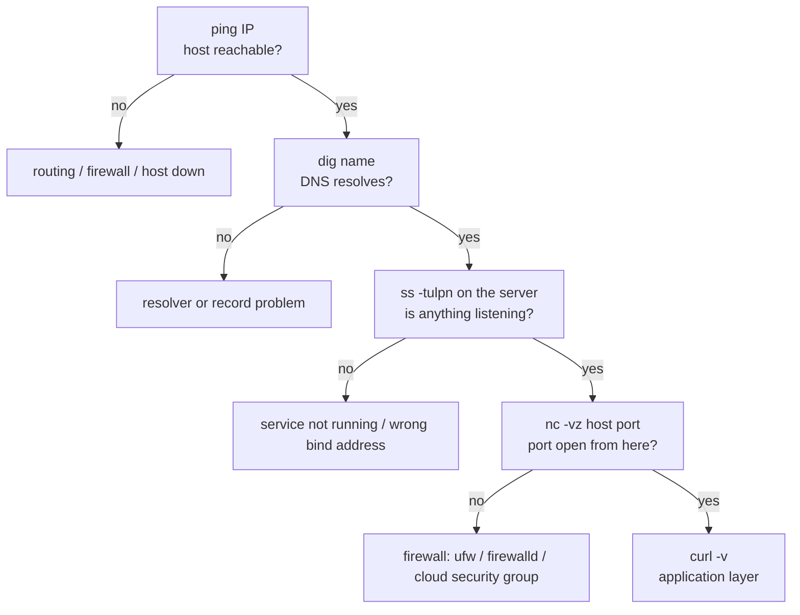

# Networking & Remote Work

## Inspecting the local machine

```bash
ip a                       # addresses per interface (replaces ifconfig)
ip r                       # routing table - `ip r get 1.1.1.1` shows the chosen route
ip -br a                   # brief, one line per interface
ss -tulpn                  # listening TCP/UDP sockets with the owning process
ss -tan state established  # current connections
ping -c 4 host             # is it reachable, and how fast
mtr host                   # traceroute + ping combined, live (the better traceroute)
dig +short example.com     # DNS lookup; `dig @1.1.1.1 example.com` to bypass the local resolver
dig -x 93.184.216.34       # reverse lookup
resolvectl status          # which DNS servers are actually in use (systemd-resolved)
```

`ss -tulpn` decodes as **t**cp, **u**dp, **l**istening, **p**rocess,
**n**umeric - the one command that answers "what is listening on this box, and
which program is it".

::: tip The old commands still in muscle memory
`ifconfig`, `netstat`, `route`, and `nslookup` come from `net-tools`, which is
deprecated and often not installed. The modern equivalents are `ip a`,
`ss`, `ip r`, and `dig`.
:::

## Debugging "I can't reach it"

Work up the stack; each step rules out everything below it.



```bash
nc -vz example.com 443             # is the TCP port open? (no data sent)
curl -sSf -o /dev/null -w '%{http_code} %{time_total}s\n' https://example.com
curl -v https://example.com        # headers, TLS handshake, redirects
sudo ufw status verbose            # Debian/Ubuntu firewall
sudo firewall-cmd --list-all       # RHEL/Fedora firewall
sudo tcpdump -i any -n port 443    # last resort: watch the actual packets
```

A service listening on `127.0.0.1` is unreachable from anywhere else no matter
how open the firewall is - `ss -tulpn` shows the bind address, and that is
usually the bug.

## `curl`: the HTTP swiss army knife

```bash
curl -fsS https://api.example.com/health        # the scripting quartet, see below
curl -O https://example.com/file.tar.gz         # save with the remote name (-o NAME to rename)
curl -L https://example.com                     # follow redirects
curl -H 'Authorization: Bearer TOKEN' url
curl -X POST -H 'Content-Type: application/json' -d '{"a":1}' url
curl -d @payload.json url                       # body from a file (@- reads stdin)
curl -u user:pass url                           # basic auth
curl --max-time 10 --retry 3 --retry-delay 2 url
curl -k url                                     # skip TLS verification - debugging only
```

`-fsS` is the combination worth memorising for scripts: `-f` makes an HTTP error
status a **non-zero exit code** (by default curl exits 0 on a 500!), `-s`
silences the progress meter, `-S` keeps real errors visible. Without `-f`, a
script happily saves a 404 page as if it were the file.

`wget` is the alternative when you want recursive downloads (`-r`) or robust
resumption (`-c`); `curl` is better for APIs.

## SSH

```bash
ssh user@host                       # connect
ssh -p 2222 user@host               # non-default port
ssh user@host 'df -h /'             # run one command and exit
ssh -t user@host 'sudo systemctl restart app'   # -t when the remote needs a TTY (sudo prompt)
ssh -J bastion.example.com user@internal        # jump through a bastion
ssh -v user@host                    # verbose - the first step for any auth problem
```

### Keys, not passwords

```bash
ssh-keygen -t ed25519 -C "alice@laptop"   # ed25519: smaller and faster than RSA
ssh-copy-id user@host                     # install the public key on the server
ssh-add ~/.ssh/id_ed25519                 # load into the agent (unlock the passphrase once)
```

Permissions are enforced by `sshd` and are a common cause of silent failures:
`~/.ssh` must be `700`, `~/.ssh/authorized_keys` and private keys `600`. A key
readable by anyone else is refused outright.

### `~/.ssh/config` pays for itself immediately

```
Host prod
  HostName 10.0.4.12
  User deploy
  Port 2222
  IdentityFile ~/.ssh/id_ed25519_prod
  ProxyJump bastion.example.com

Host *
  ServerAliveInterval 60          # keep idle sessions from dropping
  ControlMaster auto              # reuse one connection for subsequent sessions
  ControlPath ~/.ssh/cm-%r@%h:%p
  ControlPersist 10m
```

Now `ssh prod`, `scp file prod:/tmp/`, and `rsync ... prod:` all work with no
flags. `ControlMaster` makes the second and later connections to a host almost
instant.

### Tunnels

```bash
ssh -L 5432:localhost:5432 prod     # local  : your :5432 → prod's database
ssh -R 8080:localhost:3000 prod     # remote : prod's :8080 → your local dev server
ssh -D 1080 prod                    # dynamic: a SOCKS proxy through prod
```

## Copying files

| Command | Best for |
| --- | --- |
| `scp file host:/path/` | one small file, no dependencies |
| `rsync -avz src/ host:/dst/` | **everything else** - incremental, resumable, verifiable |
| `sftp host` | interactive browsing |
| `rsync -avz --delete src/ dst/` | making the destination an exact mirror |

```bash
rsync -avzh --progress src/ user@host:/srv/app/
rsync -avz --dry-run --delete src/ dst/        # ALWAYS dry-run --delete first
rsync -avz -e 'ssh -p 2222' src/ host:/dst/    # non-default port
rsync -avz --exclude-from=.rsyncignore src/ dst/
```

::: warning The trailing slash changes the meaning
`rsync src/ dst/` copies the **contents** of `src` into `dst`.
`rsync src dst/` copies the **directory itself**, creating `dst/src`. Combined
with `--delete`, getting this wrong deletes the destination's contents. Dry-run
first, every time.
:::

## Summary

- `ip a`, `ip r`, `ss -tulpn`, `dig` - the modern replacements for `ifconfig`,
  `route`, `netstat`, `nslookup`.
- Debug bottom-up: reachable → resolves → listening → port open → application.
  A `127.0.0.1` bind explains most "firewall" problems.
- `curl -fsS` in scripts, so an HTTP error is a failed command.
- Use **ed25519 keys**, `ssh-copy-id`, and a `~/.ssh/config` with
  `ControlMaster`; check the `700`/`600` permissions when auth silently fails.
- `rsync -avz` over `scp` for anything non-trivial, and mind the trailing slash.
