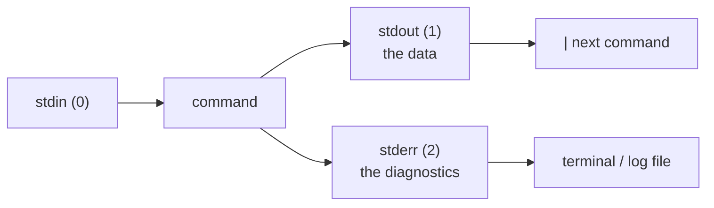

# Pipes, Redirection & Streams

## Three streams, and why the split matters

Every process starts with three open file descriptors:

| FD | Name | Default | Carries |
| --- | --- | --- | --- |
| `0` | stdin | keyboard | input |
| `1` | stdout | terminal | **the result** - the data the command produces |
| `2` | stderr | terminal | **the commentary** - errors, warnings, progress |

The separation is what makes composition possible: `curl -v url \| jq .` works
because the progress noise goes to fd 2 while the JSON goes to fd 1.



The rule for your own scripts: **anything a caller might want to consume goes to
stdout; everything else goes to stderr** (`echo "..." >&2`).

## Redirection

```bash
cmd > file          # stdout to file, TRUNCATING it
cmd >> file         # stdout appended
cmd 2> file         # stderr to file
cmd 2>> file        # stderr appended
cmd > file 2>&1     # both to the same file  (order matters - see below)
cmd &> file         # bash shorthand for the same thing
cmd < file          # file as stdin
cmd > /dev/null     # discard stdout
cmd 2>/dev/null     # discard stderr only - the usual "ignore 'not found' noise"
cmd &> /dev/null    # discard everything
```

::: warning `2>&1` order is not symmetric
`cmd > file 2>&1` sends both streams to the file. `cmd 2>&1 > file` does **not**:
`2>&1` first points stderr at wherever stdout currently is (the terminal), and
only then is stdout moved to the file. Read it as "make fd 2 a copy of fd 1
*right now*".
:::

Two more that come up constantly:

```bash
: > file            # truncate a file to zero bytes without deleting it
exec 3> log.txt     # open fd 3 for the rest of the script; write with >&3
```

## Pipes

`a | b` connects `a`'s stdout to `b`'s stdin, and runs both **concurrently** -
`b` starts consuming before `a` finishes, which is why `head` can stop a huge
`find` early.

```bash
ps aux | grep nginx | grep -v grep | awk '{print $2}'
```

A pipeline's exit status is the status of the **last** command by default,
which hides failures upstream. `set -o pipefail` changes it to the first
non-zero status (see [robust scripts](./scripting-robustness)), and
`${PIPESTATUS[@]}` holds every stage's status individually:

```bash
grep pattern missing-file | sort > out
echo "${PIPESTATUS[@]}"     # -> "2 0": grep failed, sort succeeded
```

Only stdout flows through a pipe. To pipe stderr too: `cmd 2>&1 | less`, or
`cmd |& less` in bash 4+.

## `tee`: fork the stream

```bash
make 2>&1 | tee build.log              # watch it AND save it
cmd | tee -a run.log | grep ERROR      # append, and keep filtering downstream
echo "value" | sudo tee /etc/some.conf # the fix for "sudo cmd > file" failing
```

That last one matters: in `sudo echo x > /root/f` the **shell** opens the file,
and the shell is not root. `tee` runs as root and does the writing itself.

## `xargs`: stdin becomes arguments

Some commands read stdin (`sort`, `grep`); many do not (`rm`, `mkdir`, `git`).
`xargs` bridges them.

```bash
find . -name '*.bak' -print0 | xargs -0 -r rm -f       # safe: NUL-separated
cat hosts.txt | xargs -I{} ssh {} 'uptime'             # {} = placeholder
seq 1 100 | xargs -n 10 echo                           # 10 arguments per invocation
cat urls.txt | xargs -P 8 -n 1 curl -fsSO              # 8 downloads in parallel
```

| Flag | Effect |
| --- | --- |
| `-0` | input is NUL-separated (pair with `find -print0`) |
| `-r` | do nothing when the input is empty |
| `-n N` | at most N arguments per command |
| `-I{}` | substitute each **line** at `{}`; implies `-n 1` |
| `-P N` | run N commands in parallel |
| `-t` | print each command before running it - use this while you build the line |

## Heredocs and herestrings

A heredoc feeds a literal block to a command's stdin:

```bash
cat <<EOF > /etc/motd
Welcome to $(hostname).
Managed by ${USER}.
EOF
```

Quote the terminator to disable all expansion - essential when the body itself
contains `$`:

```bash
cat <<'EOF' > deploy.sh
#!/usr/bin/env bash
echo "$HOME stays literal here"
EOF
```

`<<-EOF` strips leading **tabs** (not spaces), letting you indent a heredoc
inside a function. A herestring is the one-line version: `grep foo <<< "$var"`.

## Process substitution

`<(cmd)` gives a command's output a filename, so tools that insist on files can
read a live stream:

```bash
diff <(sort a.txt) <(sort b.txt)               # compare without temp files
comm -13 <(sort old.txt) <(sort new.txt)       # lines added
while read -r line; do ...; done < <(find . -type f)   # no subshell - see below
```

That last form solves a classic bug. `find . | while read -r l; do ((n++)); done`
runs the loop in a **subshell**, so `n` is lost when the pipeline ends. Feeding
the loop with `< <(...)` keeps it in the current shell, so variables set inside
survive.

`>(cmd)` works in the other direction: `tar -cf >(gzip > out.gz) dir/`.

## Summary

- stdout is **data**, stderr is **diagnostics** - keep them separate in your own
  scripts (`>&2`).
- `>` truncates, `>>` appends, `2>&1` merges - and its **position matters**.
- Pipelines run concurrently and report only the last status unless you set
  `pipefail` or read `${PIPESTATUS[@]}`.
- `tee` forks a stream (and fixes `sudo` redirection); `xargs` turns stdin into
  arguments - always with `-0 -r` when filenames are involved.
- Heredocs (`<<EOF`, `<<'EOF'`) supply literal input; process substitution
  `<(cmd)` supplies a file-shaped stream and avoids the subshell loop trap.
