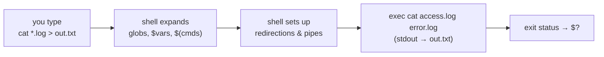

# Shell Basics & Navigation

## What the shell actually is

The shell is a program that reads a line, expands it, and runs the result. The
expansion step is where most surprises live - by the time a command starts, it
never sees what you typed, only the final list of words.



Two consequences worth internalising immediately:

- **The command never sees `*.log` or `$HOME`.** The shell replaced them first.
  That is why `grep foo *.txt` fails differently in an empty directory, and why
  quoting matters so much.
- **Redirection is the shell's job, not the command's.** `sort > out.txt` works
  even though `sort` knows nothing about `out.txt`.

`echo` is your debugger: prefix any command with it to see exactly what the
shell would run.

## Where you are, and how to move

Everything hangs off a single tree rooted at `/`. There are no drive letters.

| Command | What it does |
| --- | --- |
| `pwd` | print working directory |
| `cd DIR` | change directory |
| `cd` | go home (`~`) |
| `cd -` | go back to the previous directory |
| `cd ..` | up one level |
| `pushd DIR` / `popd` | change directory, remembering a stack to return to |

Path shorthands the shell expands for you:

| Written | Means |
| --- | --- |
| `/etc/ssh` | absolute path, from the root |
| `logs/app.log` | relative to the current directory |
| `.` / `..` | current directory / parent |
| `~` | your home directory (`~alice` = alice's home) |
| `-` (with `cd`) | the previous directory |

::: tip Absolute paths in scripts, relative paths at the prompt
Interactively, relative paths are convenient. In a script they are a bug
waiting to happen, because the caller decides the working directory. Either use
absolute paths or anchor to the script's own location:
`cd "$(dirname -- "$0")"`.
:::

## Reading a directory listing

```bash
$ ls -lah /var/log
drwxr-xr-x  12 root   root   4.0K Jul 31 09:12 .
-rw-r-----   1 syslog adm     26K Jul 31 09:14 syslog
lrwxrwxrwx   1 root   root      9 Jun  2 11:01 boot.log -> /dev/null
```

Reading `-rw-r-----` left to right: the type (`-` file, `d` directory, `l`
symlink), then three permission triples for **owner**, **group**, and
**everyone else** - covered in full on
[Permissions & Ownership](./permissions-and-ownership). The columns after it are
link count, owner, group, size, modification time, and name.

| Flag | Effect |
| --- | --- |
| `-l` | long format (permissions, owner, size, mtime) |
| `-a` | include dotfiles |
| `-h` | human-readable sizes (with `-l`) |
| `-t` | sort by modification time, newest first |
| `-S` | sort by size |
| `-r` | reverse the sort |
| `-R` | recurse into subdirectories |
| `-d` | describe the directory itself, not its contents |

`ls -lahtr` ("newest last") is the muscle-memory combination for a log
directory.

## Typing less

| Keys | Effect |
| --- | --- |
| <kbd>Tab</kbd> | complete a command, path, or (with completions installed) a flag |
| <kbd>Tab</kbd> <kbd>Tab</kbd> | list all the candidates |
| <kbd>Ctrl</kbd>+<kbd>R</kbd> | search backwards through history (press again to keep going) |
| <kbd>Ctrl</kbd>+<kbd>A</kbd> / <kbd>Ctrl</kbd>+<kbd>E</kbd> | jump to start / end of line |
| <kbd>Ctrl</kbd>+<kbd>W</kbd> / <kbd>Ctrl</kbd>+<kbd>U</kbd> | delete the previous word / the whole line |
| <kbd>Ctrl</kbd>+<kbd>L</kbd> | clear the screen (same as `clear`) |
| <kbd>Ctrl</kbd>+<kbd>C</kbd> | interrupt the running command (SIGINT) |
| <kbd>Ctrl</kbd>+<kbd>D</kbd> | end of input - exits the shell on an empty line |
| <kbd>Ctrl</kbd>+<kbd>Z</kbd> | suspend the running command (see [Processes & Jobs](./processes-and-jobs)) |

History expansions save the most keystrokes:

```bash
history | tail -20     # recent commands, numbered
!!                     # the previous command  → `sudo !!` re-runs it as root
!$                     # the last argument of the previous command
!ssh                   # the most recent command starting with "ssh"
```

## The environment

Environment variables are inherited by every process you start.

```bash
printenv                 # everything
echo "$PATH"             # colon-separated list of directories searched for commands
export EDITOR=vim        # set for this shell and its children
unset EDITOR             # remove
```

`PATH` is the one that causes the most confusion: when you type `ls`, the shell
walks `PATH` left to right and runs the first match. `which -a ls` shows every
match; `type -a ls` also reveals builtins, functions, and aliases, which `which`
misses entirely.

### Where to put your settings

| File | Read when |
| --- | --- |
| `~/.bashrc` | every **interactive non-login** shell (new terminal window/tab) |
| `~/.bash_profile` / `~/.profile` | **login** shells (SSH, console login, most display managers) |
| `/etc/profile`, `/etc/bash.bashrc` | the system-wide equivalents, for all users |
| `~/.bash_logout` | when a login shell exits |

Aliases and prompt tweaks belong in `~/.bashrc`; `PATH` and other exported
variables belong in `~/.profile`. The usual arrangement is for
`~/.bash_profile` to source `~/.bashrc` so both kinds of shell agree. After
editing, `source ~/.bashrc` applies the changes without opening a new terminal.

::: warning An alias is not a script
`alias ll='ls -lah'` is a shorthand for *your* interactive shell. Scripts do not
load `~/.bashrc`, so aliases silently do not exist there - which is a feature.
Write a function or a script instead.
:::

## Summary

- The shell **expands first, then executes**: globs, variables, and command
  substitution are gone before the command starts. `echo` shows you the result.
- Navigate with `cd`/`pwd`, and remember `cd -` and `~`.
- `ls -lah` (plus `-t` or `-S`) answers almost every "what is in here" question.
- <kbd>Ctrl</kbd>+<kbd>R</kbd>, <kbd>Tab</kbd>, `!!` and `!$` are where the real
  speed comes from.
- `PATH` decides which binary runs - inspect it with `type -a`.
- Interactive settings go in `~/.bashrc`, exported environment in `~/.profile`.
