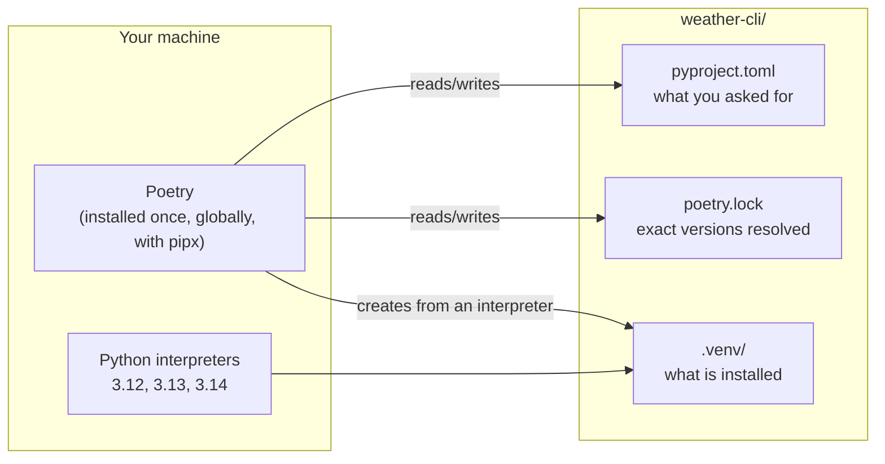

# Poetry & Virtual Environments

Every Python project needs **its own isolated environment**, and a record of
exactly what is installed in it. [Poetry](https://python-poetry.org/) handles
both. It creates and manages the virtual environment, records dependencies in
`pyproject.toml`, pins them in `poetry.lock`, and builds and publishes packages.
This page covers the environment side. [Managing Dependencies](./dependencies)
and [Building Packages](./building-packages) cover the rest.

The command output on these pages comes from real runs of Poetry 2.4.1 on
Python 3.13. Only the absolute paths are shortened.

## Why a virtual environment

A **virtual environment** ("venv") is a directory with its own `python`
executable and its own `site-packages`, the folder that `pip install` writes
to. Activate it, or run its `python` directly, and imports resolve against that
folder only.

Without one, every project shares a single global `site-packages`:

- Project A needs `httpx 0.27`, project B needs `httpx 0.28`, and only one can
  be installed.
- Upgrading a package for one project silently changes every other one.
- On most Linux distributions the system Python belongs to the OS package
  manager. Modern Debian, Ubuntu and Fedora refuse `pip install` into it
  outright with `error: externally-managed-environment` (PEP 668).

::: tip Rule
One project, one venv. Never `pip install` into the system Python, and never
`sudo pip install` anything.
:::

## The pieces



| Piece | Committed to git? | Role |
| --- | --- | --- |
| `pyproject.toml` | yes | project metadata and dependency *ranges* |
| `poetry.lock` | yes | the exact version and hashes of every package, including indirect ones |
| `.venv/` | **no** | the installed environment, rebuilt from the lock file at any time |

## Installing Poetry

Poetry is a tool for managing projects, so it must not live *inside* one of the
environments it manages. Install it once per user with
[pipx](https://pipx.pypa.io/), which gives every CLI tool its own private venv:

```bash
# Debian/Ubuntu: sudo apt install pipx     macOS: brew install pipx
# Windows: py -m pip install --user pipx
pipx ensurepath          # puts ~/.local/bin on PATH; open a new shell afterwards
pipx install poetry
poetry --version         # Poetry (version 2.4.1)
pipx upgrade poetry      # later
```

The official installer (`curl -sSL https://install.python-poetry.org | python3 -`)
does the same thing without pipx.

### Getting the Python version you need

Poetry uses an interpreter that is already installed, and it doesn't download
new ones. Get a specific version from your OS package manager, from
[python.org](https://www.python.org/downloads/) on Windows and macOS (the `py`
launcher then selects versions: `py -3.13`), or from a version manager such as
[pyenv](https://github.com/pyenv/pyenv). Recent Poetry 2 releases also have an *experimental*
`poetry python install 3.13`, which downloads a standalone build.

## One setting worth changing

```bash
poetry config virtualenvs.in-project true
```

By default Poetry keeps venvs in a cache directory, under a generated name such
as `weather-cli-Xb3k9a2Q-py3.13`. With `in-project`, each project gets its venv
at `./.venv`. VS Code, PyCharm and other tools then find it with no extra
configuration, and you delete the venv by deleting the folder.

## Starting a project

```
$ poetry new weather-cli
Created package weather_cli in weather-cli

$ find weather-cli -type f
weather-cli/pyproject.toml
weather-cli/README.md
weather-cli/src/weather_cli/__init__.py
weather-cli/tests/__init__.py
```

The distribution name uses a hyphen (`weather-cli`, what `pip install` takes).
The import name uses an underscore (`weather_cli`, what `import` takes), because
a hyphen isn't valid in a Python identifier. Poetry 2 generates the **src
layout**. [Modules & Imports](./modules-and-imports#the-src-layout) explains why
that is the right default. For an existing folder, `poetry init` asks a few
questions and writes only the `pyproject.toml`.

The generated `pyproject.toml`:

```toml
[project]
name = "weather-cli"
version = "0.1.0"
description = ""
authors = [
    {name = "Your Name",email = "you@example.com"}   # taken from your git config
]
readme = "README.md"
requires-python = ">=3.13"          # the interpreter that ran `poetry new`
dependencies = [
]

[tool.poetry]
packages = [{include = "weather_cli", from = "src"}]

[build-system]
requires = ["poetry-core>=2.0.0,<3.0.0"]
build-backend = "poetry.core.masonry.api"
```

| Table | Owned by | Contains |
| --- | --- | --- |
| `[project]` | the packaging standard (PEP 621) | name, version, Python requirement, runtime dependencies, entry points. Every modern tool reads it |
| `[dependency-groups]` | the packaging standard (PEP 735) | dev-only dependencies: test runners, linters. Added by `poetry add --group dev` |
| `[tool.poetry]` | Poetry | what to package and from where, plus Poetry-only features such as path/git dependency sources |
| `[build-system]` | the packaging standard (PEP 517) | which backend builds the wheel. `pip install .` works without Poetry installed |
| `[tool.<name>]` | that tool | settings for pytest, mypy, ruff, and others. See [Tooling](./tooling) |

::: details Coming from Poetry 1?
Poetry 1 kept everything under `[tool.poetry]`, with
`[tool.poetry.dependencies]` for runtime dependencies and
`[tool.poetry.group.dev.dependencies]` for dev ones. Poetry 2 still reads that
format, but writes the standard `[project]` and `[dependency-groups]` tables,
and `poetry shell` was removed. Tutorials and projects from before 2025 mostly
use the old layout.
:::

## Creating and inspecting the environment

`poetry install` creates the venv if needed, installs everything from the lock
file (creating the lock first if there isn't one), and then installs **your own
project in editable mode**, so `import weather_cli` works from anywhere inside
the venv:

```
$ poetry install
Creating virtualenv weather-cli in ~/code/weather-cli/.venv
Updating dependencies
Resolving dependencies...

Writing lock file

Installing the current project: weather-cli (0.1.0)
```

```
$ poetry env info

Virtualenv
Python:         3.13.11
Implementation: CPython
Path:           ~/code/weather-cli/.venv
Executable:     ~/code/weather-cli/.venv/bin/python
Valid:          True

Base
Platform:   linux
OS:         posix
Python:     3.13.11
Path:       ~/miniconda3
Executable: ~/miniconda3/bin/python3.13
```

"Base" is the interpreter the venv was created from. To switch the project to a
different Python version, point Poetry at another interpreter. It creates a
fresh venv for that version:

```bash
poetry env use python3.14      # must satisfy requires-python; a full path works too
poetry env list                # .venv (Activated)
poetry env remove --all        # throw the venv(s) away; `poetry install` rebuilds
```

::: tip Applications that are not packages
A project that is never installed as a package, such as a set of scripts, a
notebook folder, or a Django site, sets `package-mode = false` under
`[tool.poetry]`. Poetry then manages only its dependencies and doesn't try to
install the project itself.
:::

## Running things inside the environment

Two ways, and both use the venv's own `python`:

```bash
# 1. prefix a single command
poetry run python -m weather_cli
poetry run pytest
poetry run weather                 # console scripts from [project.scripts]

# 2. activate it for the whole shell session
eval $(poetry env activate)        # bash/zsh; prints and runs `source .venv/bin/activate`
python -m weather_cli              # now `python` means the venv's python
deactivate                         # leave it
```

```
$ poetry env activate
source ~/code/weather-cli/.venv/bin/activate
```

Use `poetry run` in scripts, Makefiles and CI, where it is explicit and
stateless. Activate the venv in an interactive terminal. Either way, check which
Python is running when in doubt:

```bash
python -c "import sys; print(sys.prefix)"    # ~/code/weather-cli/.venv inside the venv
```

## Without Poetry: the standard library way

`venv` ships with Python, and it's all you need for a throwaway environment or a
machine without Poetry:

```bash
python3 -m venv .venv
source .venv/bin/activate          # Windows PowerShell: .venv\Scripts\Activate.ps1
python -m pip install httpx        # always `python -m pip`: it's the pip of *this* python
pip freeze > requirements.txt      # a flat pin list, with no ranges and no groups
deactivate
```

This is fine for a quick experiment. For a project, you'd then be maintaining by
hand the things Poetry does for you: separating direct from indirect
dependencies, dev groups, a lock file that also pins hashes, and building.

::: info Alternatives
[uv](https://docs.astral.sh/uv/) covers the same ground as Poetry (a
`[project]`-based `pyproject.toml`, a lock file, `uv run`, `uv build`), is
considerably faster, and can install Python versions itself. The concepts on
these pages carry over directly. Only the command names differ.
:::

## Checklist

- Poetry is installed once, globally, with pipx. It is never inside a
  project's venv.
- `poetry config virtualenvs.in-project true`, so each project has a `.venv/`.
- `.venv/` is in `.gitignore`. `pyproject.toml` and `poetry.lock` are committed.
- `requires-python` states the lowest version you test on.
- Use `poetry run ...` in automation. Activate the venv in interactive shells.
