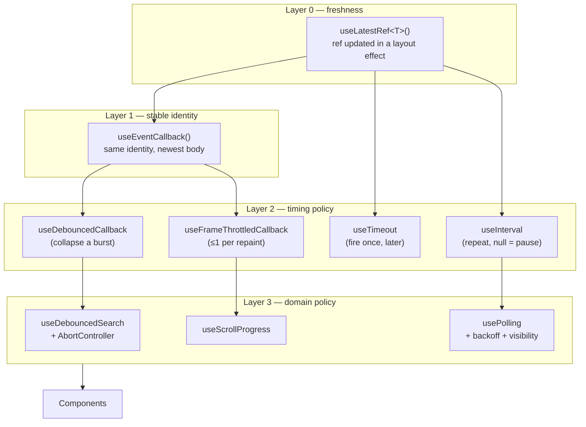
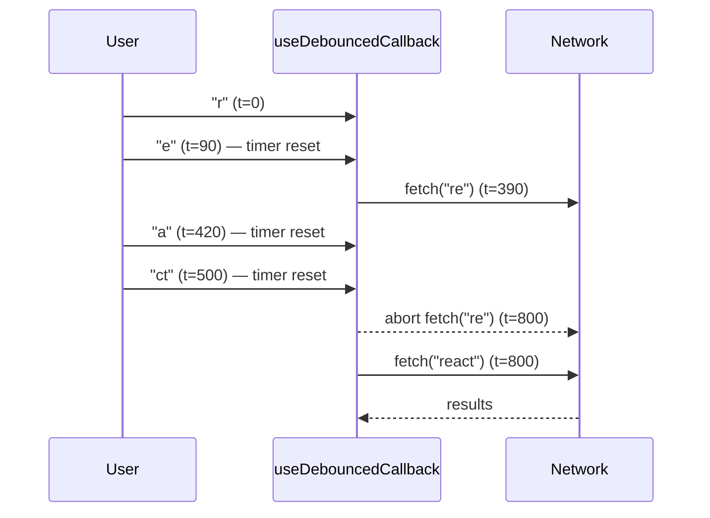

# Advanced Chaining: Callbacks & Timing

[Custom Hooks & Hook Chaining](./custom-hooks-and-chaining) covers the shape of
a chain. This page covers the hard part: chains where a **callback is scheduled
now and invoked later** - after a timeout, on an interval, on the next frame.
Every bug in this category comes from one of two mistakes:

1. The scheduled callback runs a **stale closure** (the props and state it
   captured are old by the time it fires).
2. The callback's **identity changes every render**, so the layer above it
   tears down and re-schedules the timer on every render - a timer that resets
   forever and never fires.

The fix is a single foundation layer that every timing hook chains on top of.

## The anti-pattern: a stale, self-resetting timer

```tsx
// ❌ Wrong on both counts.
function Autosave({ draft, onSave }: { draft: string; onSave: (d: string) => void }) {
  useEffect(() => {
    const id = setTimeout(() => onSave(draft), 2000);
    return () => clearTimeout(id);
    // Omit `onSave` from deps → it fires with the *first* render's callback.
    // Include it → a parent passing an inline arrow re-creates the effect on
    // every render, so the 2s timer restarts forever and never saves.
  }, [draft, onSave]);
}
```

You cannot fix this with the dependency array: the effect needs the callback to
be **fresh** but not **reactive**. That is exactly what a ref gives you.

## Layer 0 & 1: freshness without reactivity

<<< ../../examples/react/hooks/stable-callback.tsx

Two details carry the whole page:

- **`useLatestRef` writes in `useLayoutEffect`, not `useEffect`.** Layout
  effects run before passive effects in the same commit, so by the time an
  effect (or a timer it schedules) reads `ref.current`, the ref already points
  at the current render's value.
- **`useEventCallback` depends only on the ref object**, which React guarantees
  is stable for the component's lifetime. So the returned function's identity
  never changes, and every hook that lists it as a dependency - a timer, a
  subscription, an event listener - is set up exactly once.

::: tip Don't call it during render
`useEventCallback` is for callbacks invoked *later* - in an effect, a timer, or
an event handler. Calling one during render reads a ref that hasn't been updated
for this render yet, which is precisely the concurrent-rendering hazard React's
own `useEffectEvent` forbids. Use it for behaviour, never for derived values.
:::

## The full chain

Every hook below stacks on the same two layers:



## Debounce: collapse a burst, then cancel the loser

Debouncing waits for the calls to *stop*. Chaining it on `useEventCallback`
makes the debounced function itself stable, so it can safely be a dependency
upstream - and the layer above adds the piece debouncing alone can't give you:
cancelling the request that a still-in-flight earlier keystroke started.

<<< ../../examples/react/hooks/debounced-callback.tsx

The returned function carries `cancel` and `flush` because real UIs need to
break the timing contract on purpose:

<div class="vp-doc">

| Trigger | Call | Effect |
| --- | --- | --- |
| User keeps typing | `run(query)` | previous timer cleared, new one scheduled |
| Input cleared | `run.cancel()` | pending call dropped, nothing fires |
| Enter pressed | `run.flush()` | pending call fires **now**, timer cleared |
| Unmount | effect cleanup | timer cleared, request aborted |

</div>

Watch the timeline for "re" → pause → "act", with a 300 ms delay:



Without the `abort`, the `"re"` response can land *after* the `"react"` one and
overwrite the correct results. Debouncing reduces the number of races; it never
removes them. Timing hooks and cancellation belong in the same chain.

## Interval: `null` is the pause button

Making `delay` accept `number | null` turns pausing into a *value* rather than
an imperative `clearInterval` call - which means the layer above can compute it.
`usePolling` computes exactly that: `null` when the tab is hidden, otherwise an
exponentially backed-off delay derived from the failure count.

<<< ../../examples/react/hooks/use-interval.tsx

The interval restarts only when `delay` changes, and its cleanup always clears
the previous timer first:

<div class="vp-doc">

| Event | `delay` | Interval effect |
| --- | --- | --- |
| Mount, tab visible | `5000` | started; `tick()` also runs immediately |
| 1st failure | `10000` | old cleared → restarted at the new delay |
| 3rd failure | `40000` | old cleared → restarted (capped at `maxDelay`) |
| Success | `5000` | `failures` reset → restarted at the base delay |
| Tab hidden | `null` | cleared, nothing scheduled |
| Tab visible again | `5000` | restarted **and** refetched at once |
| Unmount | - | cleared, in-flight request aborted |

</div>

::: warning An interval is not a schedule
`setInterval(fn, 5000)` doesn't guarantee a call every 5 s - background tabs are
throttled to ≥1 min, and a slow response can still be in flight when the next
tick arrives. That's why `tick` aborts its own predecessor. If each run must
finish before the next is scheduled, chain `useTimeout` recursively instead of
using an interval at all.
:::

## Frame throttling: the right tool for scroll and pointer events

Debouncing a scroll handler makes the UI lag behind the scroll; running it on
every event does layout work dozens of times per frame. The frame clock is the
correct timing source - at most one call per repaint, always with the newest
arguments.

<<< ../../examples/react/hooks/frame-throttled-callback.tsx

## Choosing a timing policy

<div class="vp-doc">

| Policy | Fires | Use for |
| --- | --- | --- |
| **Debounce** | once, `delay` after the **last** call | search-as-you-type, autosave, validation |
| **Frame throttle** | ≤ once per repaint | scroll, pointermove, resize, drag |
| **Interval** | every `delay` until paused | polling, clocks, countdowns |
| **Timeout** | once, `delay` after scheduling | toasts, tooltips, "still loading…" hints |

</div>

## The cleanup rules these chains obey

1. **Every scheduler returns its canceller.** `setTimeout`/`setInterval`/
   `requestAnimationFrame` handles are cleared in the effect cleanup, so a
   pending callback can never run after unmount.
2. **Whoever starts an async request aborts it.** The debouncer cleans up its
   timer; the layer that called `fetch` cleans up the request.
3. **Cleanup runs before the next setup**, so a changed `delay` never leaves two
   timers running - and StrictMode's dev-mode `setup → cleanup → setup` is a
   free test that this holds.
4. **Nothing in the chain lists the user's callback as a dependency** - it is
   read through a ref instead, so timing is driven by timing values only.

## Summary

- Scheduled callbacks need to be **fresh but not reactive**: `useLatestRef` +
  `useEventCallback` give you that, and every timing hook chains on them.
- Chain **one concern per layer**: freshness → identity → timing policy →
  domain policy (cancellation, backoff, visibility) → markup.
- Expose timing as **values, not commands** - `delay: number | null` to pause,
  `cancel`/`flush` to override.
- **Debounce ≠ throttle ≠ interval**: match the policy to the event source.
- Pair every timing hook with **cancellation**; debouncing alone does not fix
  response races.
