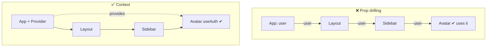
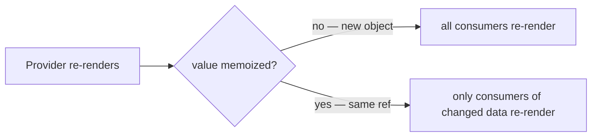
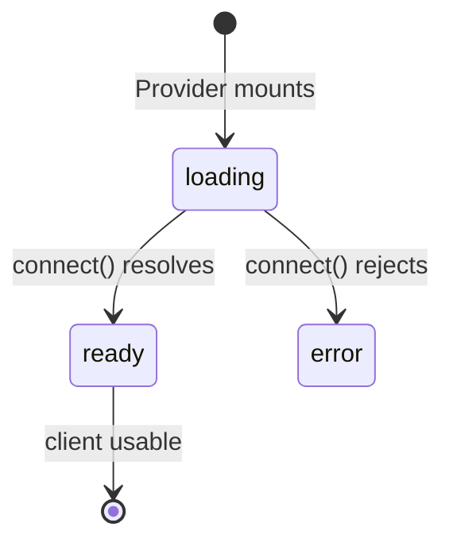
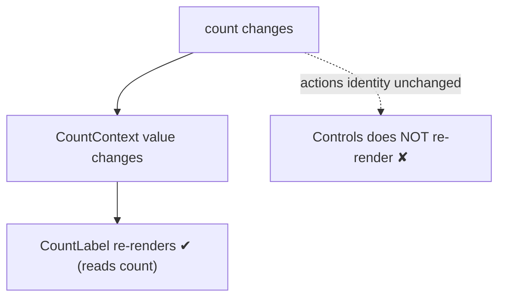

# Context: Sharing State & APIs

Context lets a component tree share a value - state, **functions**, or a whole
**API** - without threading props through every intermediate layer. This page
covers creating a typed context, passing functions and an async API through it,
knowing **when that API is ready**, and keeping re-renders under control.

## The problem it solves: prop drilling

When a deeply nested component needs data from the top, passing it prop-by-prop
forces every component in between to accept and forward props it doesn't use:

`Layout` and `Sidebar` on the right never see `user` - the `Avatar` reaches into
the context directly.

## Creating a typed context

The pitfall is `createContext`'s default value: pass a "fake" default and
consumers outside the Provider silently receive it. Instead default to
`undefined` and guard in a **custom hook** - so misuse throws loudly and
consumers get a non-null type.

<<< ../../examples/react/context/create-typed-context.tsx

This is the pattern for every context below: `undefined` default → custom
`useX()` hook that throws → consumers never touch `useContext` directly.

## Passing functions and an API through context

Context values aren't limited to data. The idiomatic way to share behaviour is
to bundle **state and the functions that change it** into one API object, expose
it through a Provider, and read it with a hook.

<<< ../../examples/react/context/context-with-api.tsx

Two details make or break this pattern:

- **`useCallback` on the functions** so their identity is stable.
- **`useMemo` on the API object.** Without it, `value={{ user, login, logout }}`
  is a *new object every render*, and **every** consumer re-renders even when
  nothing they use changed:

## When is the API *ready*? Model readiness explicitly

If a context sets up something asynchronously - a connection, a token, a client
- consumers must not call it before it exists. Encode that in the type as a
**discriminated union**, so the "ready" methods only exist on the ready variant
and the compiler forces the check.

<<< ../../examples/react/context/context-readiness.tsx

Because `client` lives only on the `status: "ready"` variant, a consumer *cannot*
call `state.client.getMessage()` without first narrowing `state.status === "ready"`.
"Is the API ready?" stops being a convention you must remember and becomes a
type error when you get it wrong. (This is the React application of
[Make Illegal States Unrepresentable](/typescript/modeling-with-unions).)

## Keeping re-renders under control: split the context

Every consumer of a context re-renders when its value changes. If some
components only need the **actions** (which never change) and not the changing
**value**, put them in separate contexts. The actions context has a stable
value, so its consumers don't re-render on data changes.

<<< ../../examples/react/context/split-context.tsx

::: tip When to use Context - and when not to
Context is for **low-frequency, widely-shared** values: theme, current user,
locale, a client instance. It is **not** a general state manager - a value that
changes many times per second (e.g. live cursor position) will re-render every
consumer. For that, reach for a dedicated store, or keep the state local and
lift it only as far as it's actually shared.
:::

## Summary

- Default context to **`undefined`** and expose a **custom `useX()` hook that
  throws** outside its Provider.
- Pass **functions and whole APIs** through context; **`useCallback`** the
  functions and **`useMemo`** the value object.
- Model async setup as a **discriminated `status` union** so "is the API ready?"
  is enforced by the type system.
- **Split value and actions** into separate contexts to avoid needless
  re-renders.
- Use Context for **low-frequency shared state**, not as a high-churn store.
