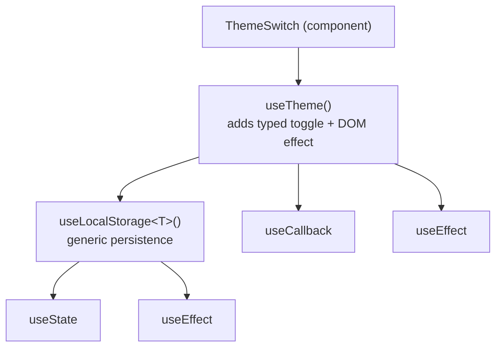

# Custom Hooks & Hook Chaining

A **custom hook** is just a function whose name starts with `use` and that calls
other hooks. Hooks are how you extract stateful logic out of components so the
components stay declarative and the logic becomes reusable and testable.

## Extracting a custom hook

<<< ../../examples/react/hooks/custom-hook.tsx

Two conventions worth adopting:

- **Return a `[value, actions] as const` tuple.** `as const` gives callers
  precise positional types (just like `useState`) and lets them rename on
  destructure: `const [open, { toggle }] = useToggle()`.
- **Wrap action callbacks in `useCallback`.** Stable function identity means the
  handlers are safe to pass to memoized children and to list in other hooks'
  dependency arrays without triggering needless work.

## Hook chaining: hooks built on hooks

"Chaining" hooks means composing higher-level hooks out of lower-level ones.
Each hook does one job; the hook one layer up calls it and layers on behaviour.
This is the single most powerful idea for keeping hook logic clean.



<<< ../../examples/react/hooks/hook-chaining.tsx

Read it bottom-up:

- `useLocalStorage<T>` is generic and knows nothing about themes - just "sync a
  value to `localStorage`."
- `useTheme` **chains** on top of it, adding a typed toggle and a DOM side
  effect, without re-implementing persistence.
- `ThemeSwitch` consumes only the top of the chain and stays a one-liner.

Each layer is independently testable, and you can reuse `useLocalStorage`
elsewhere untouched.

## The Rules of Hooks (non-negotiable)

Chaining works *only* because every hook obeys the two rules:

1. **Only call hooks at the top level** - never inside a condition, loop, nested
   function, or `try`/`catch`. React tracks hook state by call *order*; calling
   them conditionally corrupts that order.
2. **Only call hooks from React functions** - components or other custom hooks,
   never from plain utility functions or event handlers.

```tsx
// ❌ Wrong: conditional hook call - order changes between renders.
function Broken({ enabled }: { enabled: boolean }) {
  if (enabled) {
    const [x] = useState(0); // breaks the Rules of Hooks
    return <span>{x}</span>;
  }
  return null;
}
```

```tsx
// ✅ Right: call the hook unconditionally, branch on the value.
function Fixed({ enabled }: { enabled: boolean }) {
  const [x] = useState(0);
  return enabled ? <span>{x}</span> : null;
}
```

Enable the `eslint-plugin-react-hooks` rules (`rules-of-hooks` and
`exhaustive-deps`) so the linter catches both mistakes automatically.

## Summary

- A custom hook is a `use*` function that calls other hooks; use it to extract
  reusable stateful logic.
- Return **`[value, actions] as const`** and wrap actions in **`useCallback`**.
- **Chain** higher-level hooks on top of lower-level, single-purpose ones.
- Always obey the **Rules of Hooks**: top-level calls only, from React
  functions only - and let the ESLint plugin enforce it.
