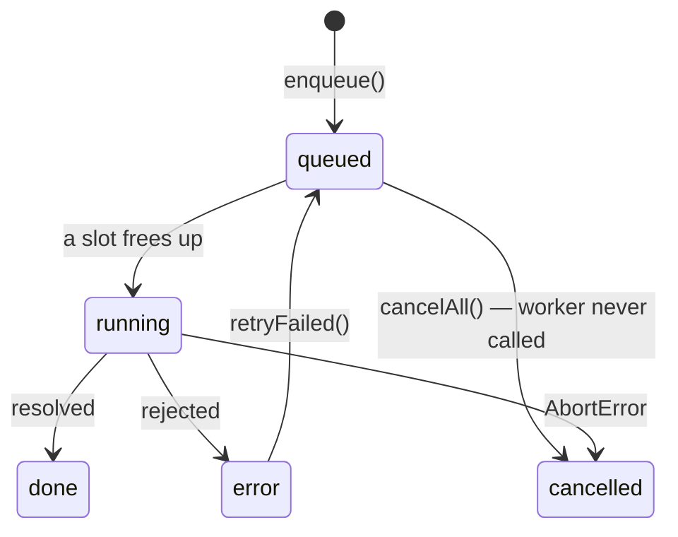

# Queues & Concurrency in Components

[Advanced Chaining: Callbacks & Timing](./advanced-hook-chaining) covers *when* a
callback runs. This page covers *how many run at once* - the timing policy for
work that is asynchronous, user-triggered, and unbounded in number: uploading a
dropped folder, importing a spreadsheet, prefetching a list, running a batch of
generated requests.

The failure mode is the same one plain JavaScript has, plus one React makes
worse.

## The anti-pattern

```tsx
// ❌ Starts one request per file, all in the same tick.
const onDrop = async (files: File[]) => {
  setBusy(true);
  await Promise.all(files.map(upload));
  setBusy(false);
};
```

With 200 files this opens 200 uploads at once: the browser serialises them at ~6
per host anyway, so nothing finishes sooner, but everything queues in a place you
cannot observe. And because the only rendered state is one `busy` boolean, the
user gets a progress indicator that sits still and then jumps to 100% - the
component knows nothing about *which* files are done, which failed, or how many
are left.

React adds the second problem: a `setState` from any of those 200 promises can
land after the user has navigated away.

## The queue hook

Three concerns, one per layer, exactly as in the timing chains:

<<< ../../examples/react/hooks/use-async-queue.tsx

The load-bearing decision is where the queue lives. It is **a ref, not state**:

<div class="vp-doc">

| Concern | Where it lives | Why |
| --- | --- | --- |
| Waiting tasks, running count, controllers | `useRef` | Mutating a ref is immediate. Deriving "is a slot free" from a `jobs` state snapshot risks starting two tasks from one slot, because the snapshot is one render behind. |
| Per-job status | `useState` | It is rendered, so it must be state. |
| The worker function | `useEventCallback` | The caller passes an inline arrow; the queue must not be re-created because of it. |

</div>

A queue is a **machine**, not derived data. Trying to drive it from an effect
over `jobs` - "start as many queued jobs as slots allow" - is the version that
looks more idiomatic and then double-starts every job under StrictMode's
`setup → cleanup → setup`, because both setups see the same snapshot.

::: tip `pump()` calling itself
`pump` is built with `useEventCallback`, so it has one permanent identity for the
component's lifetime. That is what lets it call itself from a `.finally()` to
fill the freed slot - no ref juggling, no re-created scheduler - while still
closing over the newest `concurrency`.
:::

## What each job status is for



Five states, not a boolean, because every one of them renders differently and
three of them are actionable:

<div class="vp-doc">

| Status | The user sees | Notes |
| --- | --- | --- |
| `queued` | "waiting" | Cancelling here is free - the worker is never called. |
| `running` | a spinner | Cancelling here needs the `AbortSignal` the worker was handed. |
| `done` | a checkmark | |
| `error` | the message + a retry button | `retryFailed()` re-enqueues only these. |
| `cancelled` | greyed out | Distinct from `error`: the user did this on purpose, so it is not a failure to report. |

</div>

Separating `cancelled` from `error` is the detail most implementations skip, and
it is what stops "you cancelled 40 uploads" from being rendered as "40 uploads
failed".

## The two cleanup rules

1. **Unmount aborts everything.** The cleanup aborts every live controller and
   empties the waiting list, so no request outlives the component.
2. **Nothing sets state after unmount.** `patch` checks a `mounted` ref before
   `setJobs`. A job that settles during teardown updates nothing instead of
   warning - or worse, resurrecting state for a component that is gone.

::: warning Cancelling a running job is a request, not a command
`cancelAll()` aborts the signal; whether the job stops depends on the worker
actually passing that signal to `fetch`. A worker that ignores its signal will
run to completion and report `done` after the user pressed cancel. The queue can
guarantee only that **not-yet-started** work never starts - which, as the
[JavaScript page shows](/javascript/promise-queues#aborting-drops-what-has-not-started),
is usually the overwhelming majority of it.
:::

## Choosing a concurrency

Nothing about React changes what the right number is - it comes from whatever is
contended on the other end:

<div class="vp-doc">

| Work | Sensible ceiling |
| --- | --- |
| Uploads / API calls to one host | 3-6 (the browser's own per-host cap is ~6) |
| Calls through your own backend to a rate-limited third party | whatever that API allows, enforced server-side too |
| CPU work in Web Workers | `navigator.hardwareConcurrency`, minus one |
| Writes to the same record | `1` - a queue with `concurrency: 1` is a mutex |

</div>

The mechanics of the limit - and the rate limiting, retries and deadlines that
usually sit on top of it - are the same in and out of React:
[Promise Queues & Concurrency Limits](/javascript/promise-queues) and
[Timers, Rate Limits & Scheduling](/javascript/timers-and-scheduling).

## Summary

- Unbounded `Promise.all(files.map(upload))` doesn't make anything faster; it
  moves the queue somewhere you can't render, cancel, or report on.
- Keep the queue in **refs** and mirror it into state - it is a machine, not
  derived data, and StrictMode punishes the state-driven version.
- Chain `pump` on `useEventCallback` so it can call itself and still see the
  newest `concurrency`.
- Model each job as a **status union**, and keep `cancelled` separate from
  `error`.
- Unmount aborts every controller; nothing calls `setState` after unmount.
- Cancelling reliably stops only what has not started - the worker has to honour
  its `AbortSignal` for the rest.
