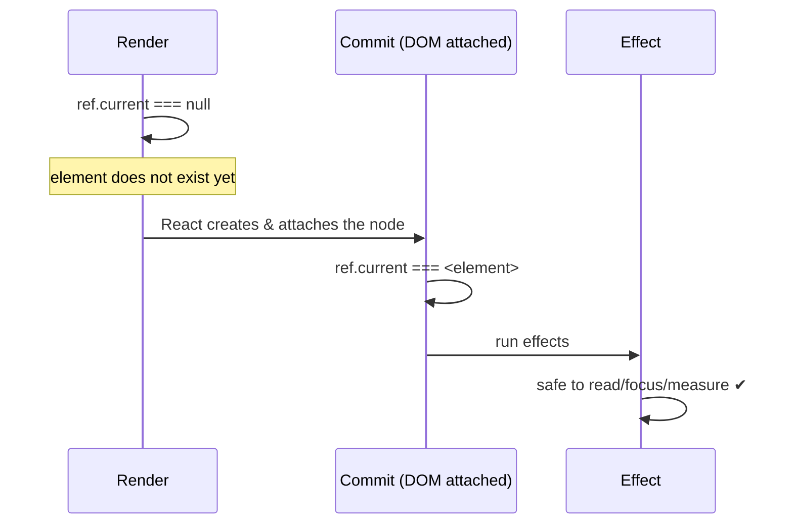
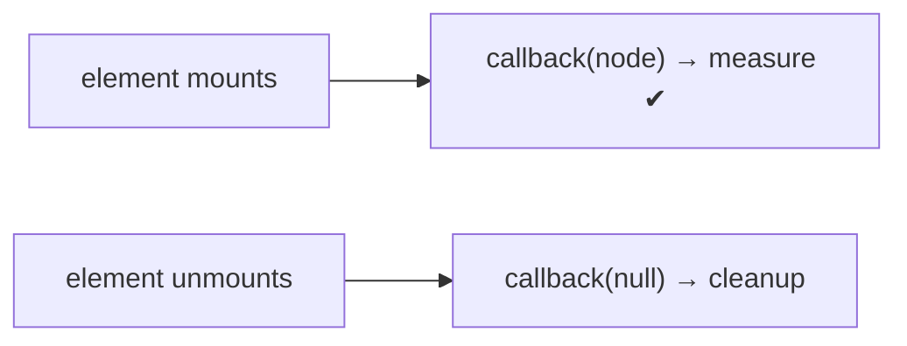
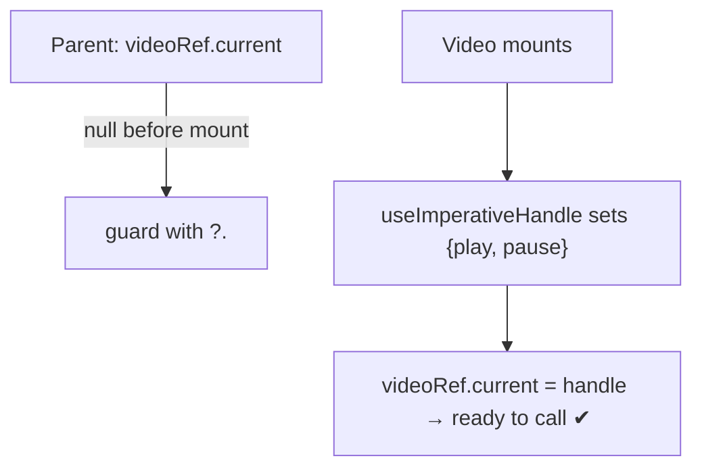

# When Elements & APIs Are Ready

A recurring source of `null is not an object` bugs is touching a DOM element -
or calling into a child - **before it exists**. React has a precise timeline for
when a ref is populated. This page makes that timeline explicit and shows the
three tools for reacting to availability: **effects**, **ref callbacks**, and
**imperative handles**.

## The ref availability timeline

`ref.current` is `null` while React computes your JSX. React attaches the real
node during the **commit** phase, *before* effects run. So the earliest safe
place to read the element is an effect or an event handler - never the render
body.

<<< ../../examples/react/refs/ref-availability.tsx

| Where you read `ref.current` | Value | Safe? |
| --- | --- | --- |
| Render body | `null` | ❌ element doesn't exist yet |
| `useLayoutEffect` | the node | ✅ before paint (for measuring) |
| `useEffect` | the node | ✅ after paint (the default) |
| Event handler | the node | ✅ user acted, so it's mounted |

## Reacting to availability itself: ref callbacks

An **object ref** tells you the node *eventually*, but not the moment it
attaches. A **ref callback** runs with the node the instant it's attached, and
with `null` when it detaches - ideal for measuring an element that may mount
later, conditionally.

<<< ../../examples/react/refs/ref-callback.tsx

Reach for a ref callback (over an effect + object ref) when the element appears
**after** the first render or you need to run code *exactly* on attach/detach.

## Exposing a child's API when it's ready: imperative handles

To let a parent call *into* a child (focus, play, scroll), don't leak the DOM
node - expose a small typed **API of functions** with `forwardRef` +
`useImperativeHandle`. The handle materializes on the parent's ref exactly when
the child mounts.

<<< ../../examples/react/refs/imperative-handle.tsx

The parent guards with `videoRef.current?.play()` because the handle is `null`
until `<Video>` has mounted - the same availability rule as raw DOM refs,
applied to a functions-only API.

::: warning Refs are an escape hatch
Prefer props and state for anything that can be expressed declaratively. Use
refs for genuinely imperative things the render model can't express: focus
management, text selection, media playback, scroll position, and integrating
non-React widgets. If you're storing render-affecting data in a ref, it probably
wants to be state instead.
:::

## Summary

- `ref.current` is **`null` during render**; React attaches the node at
  **commit**, so read it in an **effect** or **event handler**.
- Use a **ref callback** to react to an element **attaching/detaching**,
  especially when it mounts conditionally.
- Expose a child's imperative **API of functions** via **`forwardRef` +
  `useImperativeHandle`**, and guard the parent ref with `?.` until it's ready.
- Treat refs as an **escape hatch** - prefer props and state where you can.
