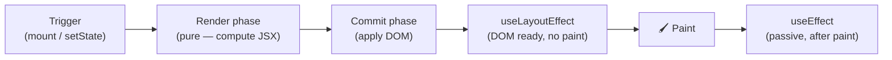
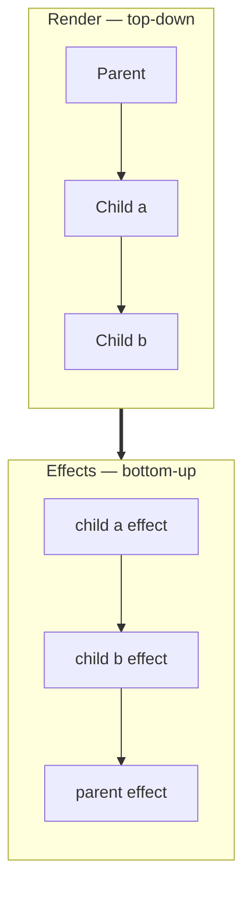

# Rendering & Component Lifecycle

To place hooks and effects correctly you need a mental model of *when* React
runs your code. This page walks the render → commit → effects pipeline, the
order components mount in, and how a single hook behaves across mount, update,
and unmount.

## The render pipeline

Every update flows through the same phases, in this order:

1. **Trigger** - an initial mount, or a state/prop change schedules a re-render.
2. **Render phase** - React calls your component function (and its children) to
   compute the next JSX. This must be **pure**: no side effects, no DOM access,
   no mutation. React may even run it twice in development (StrictMode) to flush
   out impurity.
3. **Commit phase** - React applies the minimal DOM changes.
4. **Layout effects** (`useLayoutEffect`) run - DOM is updated but **not yet
   painted**. Read/measure layout here.
5. **Paint** - the browser draws the frame.
6. **Passive effects** (`useEffect`) run - **after** paint. The default home for
   side effects.

This example logs each phase so you can watch the order in a real browser:

<<< ../../examples/react/lifecycle/effect-order.tsx

Run it and click the button. On mount you'll see
`render → layout effect → passive effect`. On each click you'll see the same
sequence again (dependency-scoped effects also run their **cleanup** before
re-running). On unmount, only the **cleanup** runs.

::: tip `useEffect` vs `useLayoutEffect`
Default to **`useEffect`** - it runs after paint and doesn't block it. Reach for
**`useLayoutEffect`** only when you must read layout (e.g. measure an element)
or write to the DOM *before* the user sees the frame, to avoid a visible
flicker. Overusing it hurts perceived performance.
:::

## Mount order: render top-down, effects bottom-up

Rendering flows **parent → child** (the parent produces the children). Effects
fire in the opposite order - **child → parent** - so by the time a parent's
effect runs, every child has already mounted and run its own effects.

<<< ../../examples/react/lifecycle/mount-order.tsx

| Phase | Order |
| --- | --- |
| Render | `Parent` → `Child a` → `Child b` |
| Effects (mount) | `child a` → `child b` → `parent` |
| Cleanup (unmount) | `child a` → `child b` → `parent` (child-first) |

This is why you can't rely on a *parent* effect to set something up *before* a
child's effect reads it - the child's runs first. Setup that a child depends on
belongs above the tree (a provider, a prop), not in the parent's effect.

## How one hook behaves across scenarios

A single `useEffect(fn, deps)` behaves differently depending on `deps` and the
lifecycle moment:

| Scenario | `deps` = `[]` | `deps` = `[a, b]` | `deps` omitted |
| --- | --- | --- | --- |
| **Mount** | runs once | runs once | runs |
| **Re-render, deps unchanged** | skipped | skipped | runs every render |
| **Re-render, a dep changed** | skipped | cleanup → run again | runs |
| **Unmount** | cleanup once | cleanup once | cleanup |

The same table applies to `useMemo`/`useCallback`, minus the cleanup: `[]`
computes once, `[deps]` recomputes when a dep changes, omitted recomputes every
render (which defeats the point).

## StrictMode: effects run twice in development

In development, React 18+ **intentionally** mounts, unmounts, and re-mounts each
component once - so every effect runs `setup → cleanup → setup`. This is a smoke
test: an effect that isn't correctly cleaned up (a duplicated subscription, a
leaked timer, a double fetch without an `ignore`/`AbortController` guard) will
misbehave visibly. It does **not** happen in production. The fix is never to
disable StrictMode - it's to make the effect's cleanup correct, exactly as on
[State & Effects](./state-and-effects).

## Summary

- The pipeline is **trigger → render (pure) → commit → layout effects → paint →
  passive effects**.
- **Render is top-down; effects are bottom-up** (child before parent), and
  cleanup runs child-first on unmount.
- Default to **`useEffect`**; use **`useLayoutEffect`** only to read/write
  layout before paint.
- A hook's behavior across mount/update/unmount is governed entirely by its
  **dependency array**.
- **StrictMode double-invokes effects in dev on purpose** - treat a failure
  there as a real cleanup bug to fix.
