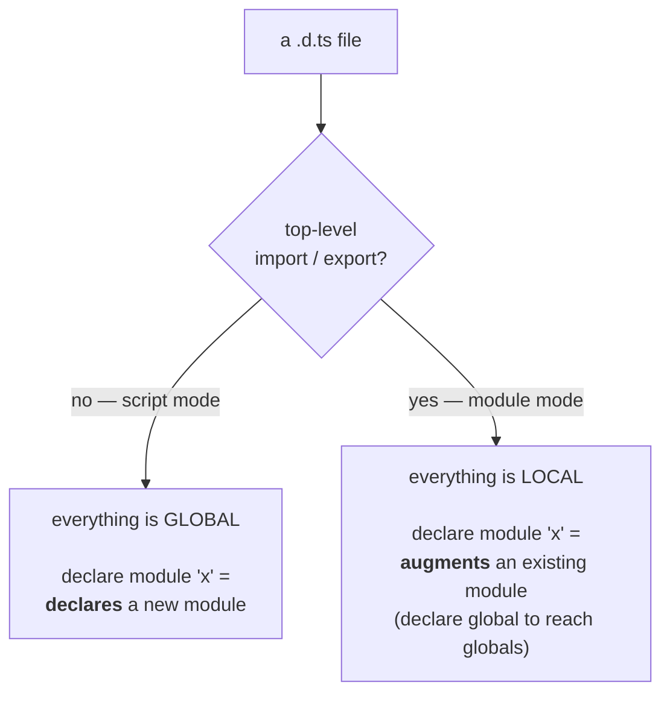

# `.ts`, `.tsx` & `.d.ts`

TypeScript has three file kinds and they are not interchangeable. Two of them
produce JavaScript; the third produces nothing at all and exists purely to tell
the compiler about code it cannot see. Picking the wrong one gives you either a
syntax error with a baffling message, or a declaration that silently declares
nothing.

| Extension | Contains | Emits JS | Use for |
| --- | --- | --- | --- |
| `.ts` | types **and** runtime code | yes | everything, by default |
| `.tsx` | the same, plus JSX syntax | yes | files that actually contain JSX |
| `.d.ts` | type declarations **only** | **no** | describing code that exists elsewhere |

## `.ts` vs `.tsx`: one difference, two consequences

`.tsx` is not "TypeScript for React". It is "TypeScript that also parses JSX",
and turning that parsing on costs you the angle bracket for anything else.

<<< ../../examples/typescript/declarations/tsx-file-kind.tsx

That is why a generic arrow function breaks the moment you rename `.ts` to
`.tsx`:

```tsx
// ❌ In a .tsx file, `<T>` opens a JSX tag.
const identity = <T>(value: T): T => value;
//                ^ TS17008: JSX element 'T' has no corresponding closing tag
//                            TS1382: Unexpected token
```

Three fixes, all in the example above: a trailing comma (`<T,>`), a constraint
(`<T extends unknown>`), or a `function` declaration, which is never ambiguous.
The second casualty is the angle-bracket type assertion - `<HTMLInputElement>el`
does not parse in `.tsx`, which is one more reason to standardise on `as`
everywhere.

::: tip A React file with no JSX should be `.ts`
Hooks, reducers, context factories, API clients and type-only modules do not
contain JSX, so they gain nothing from `.tsx` and inherit its parsing quirks.
The repo's own React examples follow the rule the other way round too - see
[Component Declarations](/react/component-declarations).
:::

## What a `.d.ts` actually is

A declaration file is the type half of a module with the implementation removed.
It is what ships in a package's `types` field so consumers get types without
compiling your source. Three properties follow from "types only":

- **It emits nothing.** A `.d.ts` never becomes JavaScript.
- **It cannot contain implementations.** No function bodies, no initialisers.
  Everything is `declare`d.
- **`declare` is an unchecked promise.** It asserts that something exists at
  runtime. If it doesn't, or if it has a different shape, nothing catches that -
  not at compile time, and not until production.

That last point is the reason for the rule below.

::: warning Don't hand-write a `.d.ts` for your own code
If you own the source, write normal `.ts` and let the compiler generate the
declarations with `"declaration": true`. Generated declarations cannot drift
from the implementation; hand-written ones drift the first time someone renames
a function. Hand-write a `.d.ts` only for code TypeScript genuinely cannot see:
an untyped dependency, a global from a `<script>` tag, or a module your bundler
invents.
:::

## The thing that trips everyone: script mode vs module mode

A `.d.ts` is in **script mode** if it has no top-level `import` or `export`, and
**module mode** if it has either. The same `declare module "x"` syntax means
opposite things in the two modes:



Adding one `import` to the top of a working script-mode declaration file turns
every ambient module in it into an augmentation of a package that may not
exist - and an augmentation of a non-existent module declares nothing at all.
The failure surfaces far away, at the import site:

```ts
// ❌ declarations.d.ts — the `export {}` makes this a MODULE
export {};
declare module "untyped-package" {
  export const x: number;
}

// somewhere else:
import { x } from "untyped-package";
//                 ^ TS2307: Cannot find module 'untyped-package'
//                   or its corresponding type declarations.
```

Delete the `export {}` and the identical `declare module` block starts working.
That is the whole bug.

## Script mode: ambient modules, asset shims, globals

<<< ../../examples/typescript/declarations/ambient-declarations.d.ts

Four jobs, all of which need global reach and therefore script mode:

1. **An ambient module** gives an untyped dependency a public interface. You are
   describing someone else's JavaScript, so keep it minimal - declare the parts
   you use and widen later, rather than guessing at the whole surface.
2. **A wildcard module** (`*.svg`, `*.module.css`) types the imports your bundler
   invents. TypeScript cannot resolve them because they are not modules until
   build time.
3. **Interface merging with `Window`** adds a build-injected global. In script
   mode this is a plain `interface Window`; no `declare global` is needed,
   because there is no module scope to escape.
4. **A `declare namespace`** describes a `<script>`-tag library that hangs
   everything off one global object. This is the pattern
   [`@types/react` itself uses](./namespaces) - `declare namespace React`.

And here is the consumer that makes any of it worth having:

<<< ../../examples/typescript/declarations/using-ambient-declarations.ts

A declaration file is never verified by its own contents - it compiles whatever
you write. The consumer is the test. Rename `track` to `trackRenamed` in the
declaration and this file immediately fails with `TS2614: Module
'"legacy-analytics"' has no exported member 'track'`, which is exactly the
feedback the declaration alone cannot give you.

## Module mode: augmenting what already exists

<<< ../../examples/typescript/declarations/module-augmentation.d.ts

Augmentation is [interface merging](./namespaces#interface-merging) reached
through a module: reopen a type from a package you do not control and add to it.
The canonical case is React's `CSSProperties`, which rejects unknown keys, so a
`--brand-hue` custom property passed in a `style` prop is an error until you
widen it.

<<< ../../examples/typescript/declarations/using-module-augmentation.ts

`declare global` is the escape hatch that gets you from module scope back to
global scope. Use it sparingly - the `Array.atOrThrow` declaration in the
example is deliberately uncomfortable. It tells the entire project that every
array has a method that exists only if a polyfill was loaded, and no type error
will ever remind you of that condition.

## Where declarations come from

| Source | How you get types | Notes |
| --- | --- | --- |
| The package ships them | nothing to do | a `types`/`typings` field, or `exports` with a `"types"` condition |
| DefinitelyTyped | `npm i -D @types/foo` | community-maintained, versioned separately from the package |
| Neither | your own ambient `.d.ts` | last resort, and only for what you use |
| Your own source | `"declaration": true` | never hand-write these |

::: tip `skipLibCheck` is about `.d.ts` files, not yours
`"skipLibCheck": true` (on in this repo's `tsconfig.json`) tells the compiler not
to type-check the *contents* of `.d.ts` files - including the ones in
`node_modules`. It makes builds faster and stops one badly-typed dependency from
breaking your build. It does **not** weaken checking of your own code, and it
does not stop declarations from being applied.
:::

## Summary

- `.tsx` only exists to parse JSX; a React file with no JSX should be `.ts`.
- In `.tsx`, write generics as `<T,>` and assertions as `as` - the angle-bracket
  forms are ambiguous with JSX tags.
- A `.d.ts` emits nothing and checks nothing about the runtime - `declare` is an
  unverified promise.
- Generate declarations for code you own; hand-write them only for code the
  compiler cannot see.
- **Script mode declares, module mode augments.** A stray top-level `import` or
  `export` silently flips the meaning of every `declare module` in the file.
- Every declaration file needs a consumer, because that is the only place a
  mistake in it can surface.
- Reach global scope from a module with `declare global`, and do it rarely.
